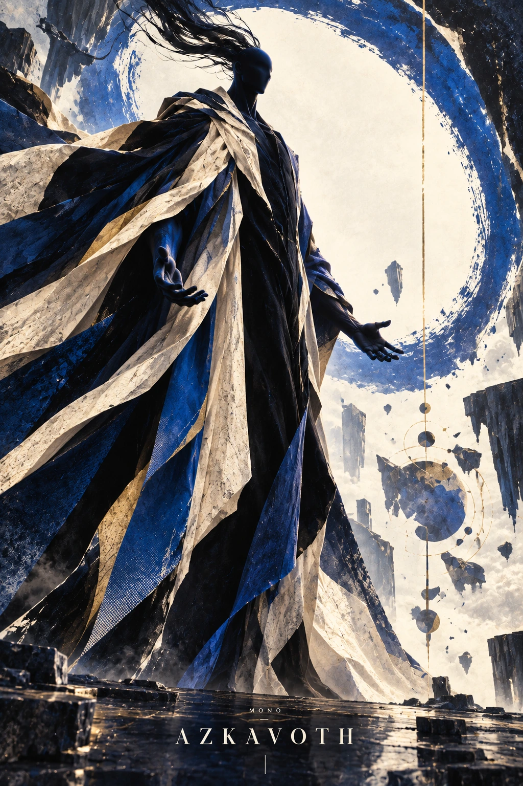
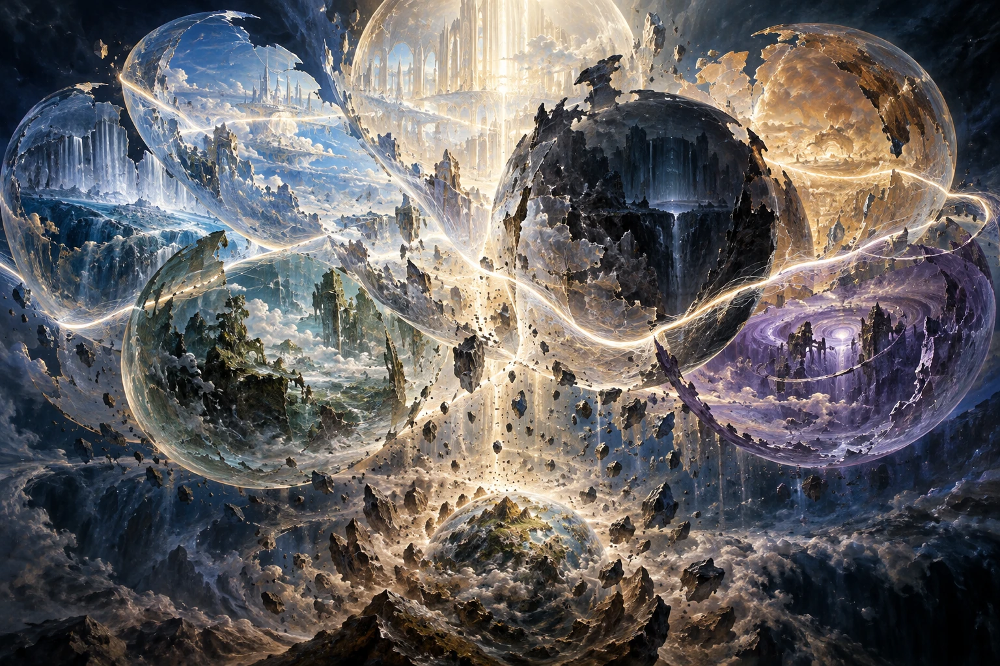
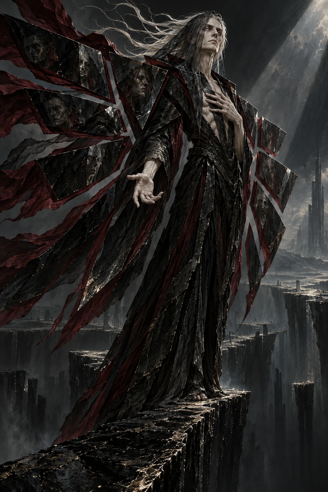
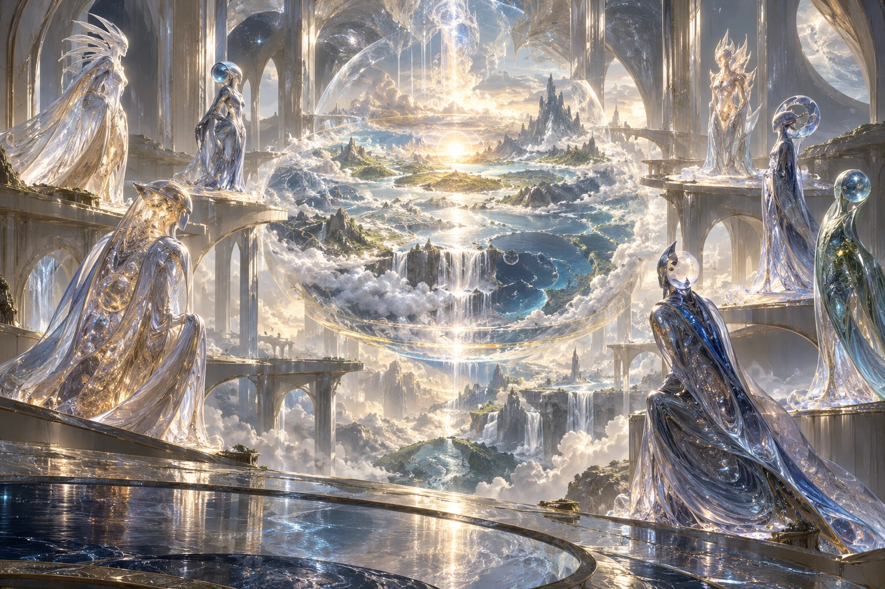
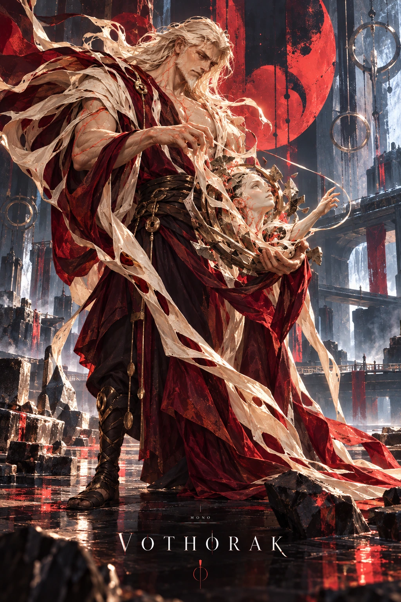
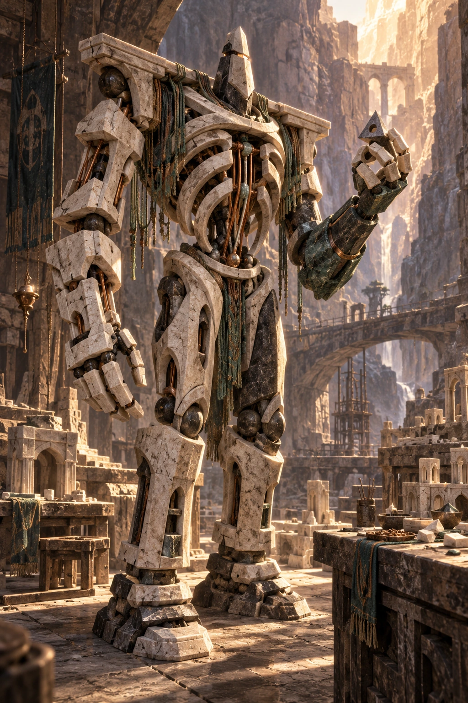
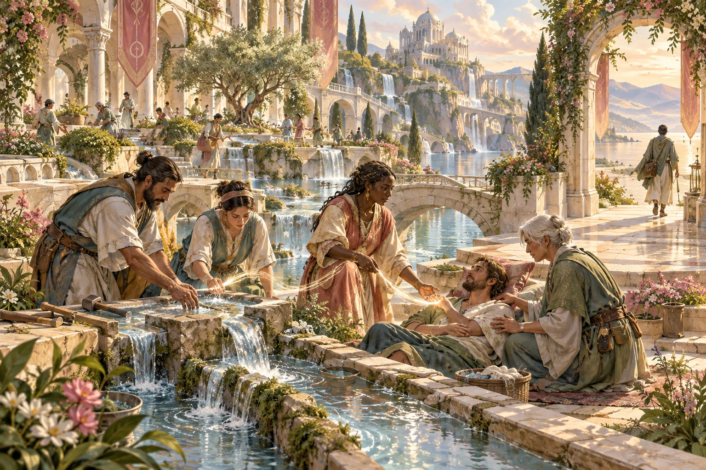
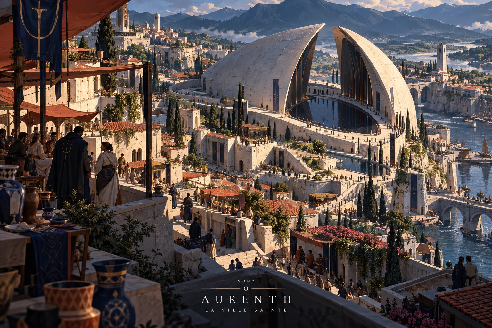

# MONO — Canon V1.0

Version consolidée le 2026-10-10. Source éditoriale : src/data/canon.json.

Les descriptions visuelles sont des interprétations. Faits établis, mystères de l’univers et développements encore ouverts sont distingués.

# L’Océan et le Nom

Du premier acte à l’Arbre brisé.

## Avant toute rive

Avant les distances, il y avait Aïnôreth. Un océan de lumière sans rive, sans astre et sans dehors. Le néant désigne ici l’absence de formes distinctes : rien n’était séparé, mais cette plénitude n’était pas une inexistence. Une seule présence incarnait son tout.

*La Première Figure : interprétation de la présence contractée, jamais sa totalité.*

Son premier acte fut de se nommer AZKAVOTH. AZ, la Source ; KA, le Lien ; VO, la Forme ; TH, l’Épanchement. Le Nom ne partagea pas cette présence en quatre dieux. Il rendit ses principes intelligibles. Puis la présence prit une silhouette : la Première Figure, une manifestation choisie qui ne contenait pas sa totalité.

AZKAVOTH contracta Aïnôreth. Pour la première fois, une étendue put être distinguée de ce qui la remplissait. L’univers et les Cieux s’ouvrirent, encore vides. Sept Témoins muets étaient présents dans ce même événement. La Source reconnut leur nécessité : la création avait des témoins, sans qu’un témoin en devienne l’auteur.

## Les sept Sphères

AZKAVOTH ordonna les Cieux en un Arbre séphirotique de sept Sphères. Chacune portait un principe de la réalité ; auprès de chacune fut formé un Archange. Au-dessus demeurait le Trône, qui ne constituait pas une huitième Sphère. Qerath gardait alors légitimement la Gnose et la vérité d’Oshen.

*Évocation des sept principes. L’illustration symbolique ne restitue pas littéralement l’Arbre intact.*

L’Arbre se brisa. La cause profonde de cette Déchirure demeure inconnue. Les principes survécurent à leur architecture commune. AZKAVOTH investit les gardiens de l’autorité de leurs Sphères et remplaça l’Arbre par sept degrés métaphysiques. Monter dans les Cieux ne signifiait pas gagner de l’altitude au-dessus d’une planète.

Il forma ensuite la matière finie. Étoiles, trous noirs et planètes trouvèrent leur ordonnance, avec la participation des Archanges. Terra reçut des océans, des sols, des organismes et les premiers Humains. Cette vie pouvait mourir. Elle existait avant le Sillage et avant Vothorak.

# Le Refus et la Promesse

Qerath, les Abysses et le Grand Retrait.

## Une question devient un refus

Qerath avait été un gardien légitime. Il interrogeait la Source : pourquoi créer des êtres promis à mourir ? De quel droit leur demander de traverser cette condition ? Sa parole mettait en cause la légitimité du dessein, sans que toute question soit une faute.

*Qerath : un gardien devenu souverain banni, dont l’objection précède le Sillage.*

La rupture survint lorsqu’il refusa la charge d’accompagner les mortels. AZKAVOTH le bannit et ouvrit les Abysses pour lui. Tamariel reçut la garde d’Oshen. Qerath emporta son objection et devint un souverain opposé aux Cieux. Le Sillage n’existait pas encore : son premier refus ne pouvait venir d’un déclin qu’il n’avait pas observé.

Plus tard, après le Retrait, il détacherait sept parts de sa puissance. Les Revers deviendraient sept personnes, avec leurs propres réponses. Cette histoire appartient au Codex ; elle ne transforme pas rétrospectivement le gardien d’Oshen en maître de sept charges célestes.

## Je ne vous laisse pas seuls

Terra vivait déjà lorsque la Source annonça son départ : « Je dois partir pour un temps. Ce départ est mon devoir, et sa nécessité est entière. Je reviendrai. Attendez, cherchez ; je ne vous laisse pas seuls. » La Promesse était authentique. Elle ne donnait ni date de retour ni explication complète du devoir.

*Les sept Témoins aux origines. Après le Retrait, six demeurent en Éden.*

AZKAVOTH se retira. Un des Sept Témoins fit le même retrait ; les six autres demeurèrent en Éden. Qu’il ait suivi la Source reste une hypothèse. Cet instant marque CD 0, le commencement du Calendrier du Départ.

Quatre singularités furent laissées selon le Nom. AZ demeura au Trône, Vestige d’une conscience limitée. KA éclata et imprima durablement l’univers : le Sillage actif issu de ce don était fini. VO et TH descendirent sur Terra et fusionnèrent. De leur rencontre naquit Vothorak. Le monde ne commençait pas avec lui ; son œuvre allait en transformer la face.

# Les Vivants et l’Architecte

Six origines, une œuvre reçue.

## Une terre déjà vivante

Vothorak s’éveilla sur une planète qui ne l’avait pas attendu pour porter la vie. Sa mémoire héritée mêlait l’élan créateur du Nom à sa propre naissance. Il prit parfois cette mémoire pour la preuve qu’il avait toujours été. Pourtant les Humains lui préexistaient, comme les astres et les mers.

*Vothorak, l’Architecte : ses œuvres transforment Terra après le Retrait.*

Il remodela des territoires, canalisa des foyers de souffle et prépara des matrices minérales. Les Djinns s’éveillèrent dans l’accord du Sillage, des feux et des souffles ; ses ouvrages favorisèrent ces naissances. Les premiers Anakim émergèrent des matrices où il concentrait durablement le fluide pour stabiliser son œuvre.

Les corps golems furent ses créations les plus directes. Il assembla leurs matériaux et leurs canaux, ouvrant les conditions d’une vie propre. Mais façonner un corps ne commandait pas la personne qui s’y éveillait. Toute la grandeur de l’Architecte et son erreur future tenaient dans cet écart : rendre une existence possible ne lui donnait pas le droit de la posséder.

## Six façons d’habiter

Les Humains apprirent à conduire un don reçu après leur naissance. Les Djinns durent préserver la continuité de leur corps fluide ; les Anakim transportaient difficilement leur ancrage. Les Golems apprirent à entretenir leurs canaux et, avec savoir et matière, à modifier leur forme. Une aptitude ouvrait une pratique ; elle n’écrivait pas une destinée.

*Une forme façonnée peut devenir l’œuvre de celui qui l’habite.*

D’autres filiations échappaient au démiurge. Des Veilleurs de Malkiel incarnés s’unirent à des Humains ; les Néphilim furent leur descendance mortelle. Ces Veilleurs n’étaient pas les Sept Témoins muets. Dans les Abysses, les descendances des Revers formèrent les Maisons qerathim. Elles héritèrent de sensibilités aux inversions, sans hériter automatiquement du pouvoir de leurs ancêtres.

Les peuples ne se répartissaient pas selon six frontières naturelles. Les cinq lignées terrestres coexistèrent ; les Qerathim pouvaient aussi franchir les seuils de Terra. Chaque personne pouvait choisir une religion, la discuter ou vivre hors de ses institutions. Ni matière, ni sang, ni reconnaissance d’un culte ne fixaient sa valeur.

# Les Quatre Traditions

Un même don, quatre manières de le conduire.

## Vivre pendant l’absence

La Promesse ne disait pas aux vivants de suspendre leur vie. Après le Retrait, quatre religions se développèrent autour des principes du Nom. La Source cherchait à discerner le vrai ; le Lien à maintenir des relations vivables ; la Forme à bâtir des structures durables ; l’Épanchement à transmettre ce qui avait été reçu.

*La pratique du Lien : soigner et soutenir à travers des contributions réglées.*

Leurs différences se lisaient dans le travail. Devant un ouvrage fragilisé, un praticien de la Source recherchait la rupture cachée. Le Lien répartissait la charge entre des appuis préparés. La Forme reconstruisait les canaux et les matériaux. L’Épanchement pouvait déployer un passage temporaire de circulation. Aucun de ces gestes ne créait une réserve infinie.

Une découverte pouvait rester sans réparation ; un réseau perdre ses relais ; un ouvrage imposer trop de contraintes ; un déploiement épuiser son alimentation. Les quatre traditions enseignaient des méthodes avec les mêmes sept voies. Les non-croyants pouvaient aussi les apprendre. La foi donnait une direction à la pratique, sans confisquer le don.

## Le monde à continuer

Les quatre religions traversèrent les lignées et les continents. Les préférences d’un lieu vinrent de son histoire, de ses métiers et de ses institutions. Un Djinn pouvait bâtir selon la Forme ; un Golem chercher selon la Source. Vénérer Vothorak ne définissait pas tous les fidèles de la Forme.

*Aurenth : une cité terrestre habitée, où les traditions se rencontrent.*

Le présent de MONO se situe vers CD 12600, à l’ouverture de l’Éveil des Brisures. Aurenth, en Avarn, offre un premier lieu pour comprendre ce monde habité. Sa neutralité dépend d’accords entretenus ; ses hospices, ses ateliers et ses marchés dépendent des convois et de réserves limitées. Son sanctuaire conserve une empreinte du regard d’Éden ; les Témoins eux-mêmes demeurent dans les Cieux.

Les Brisures rendent les passages incertains et les réserves disputées. Le Grand Rite, le Voile et les paroles des prophètes ont laissé leurs traces dans les pratiques, les ouvrages et les institutions. Les habitants en portent les conséquences sans connaître toute leur histoire. À Aurenth, comprendre le passé commence par regarder ce qui permet encore au monde de continuer.
