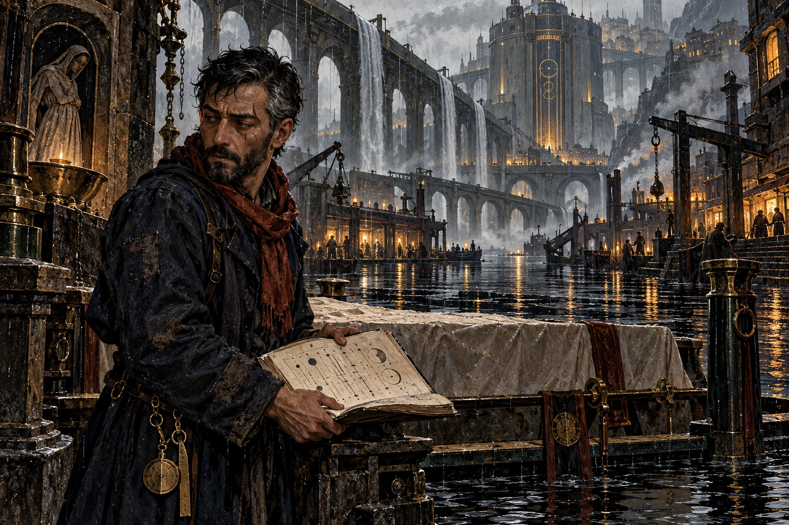
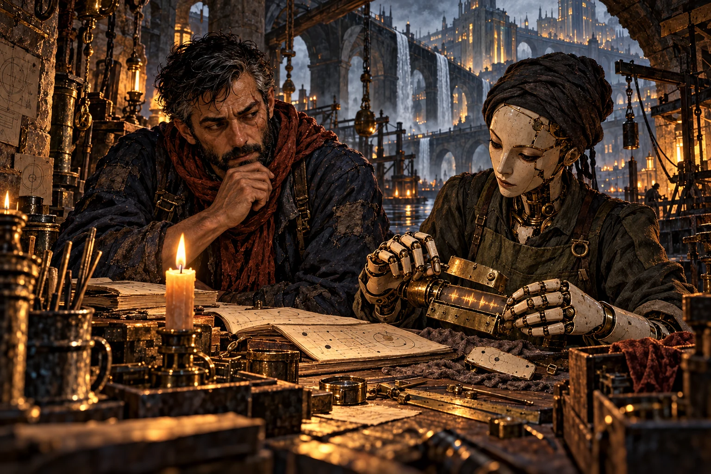
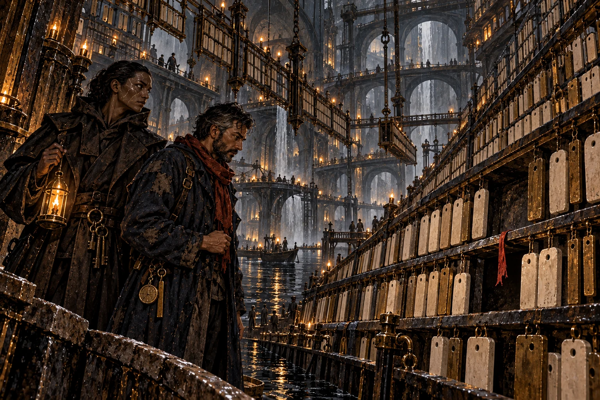
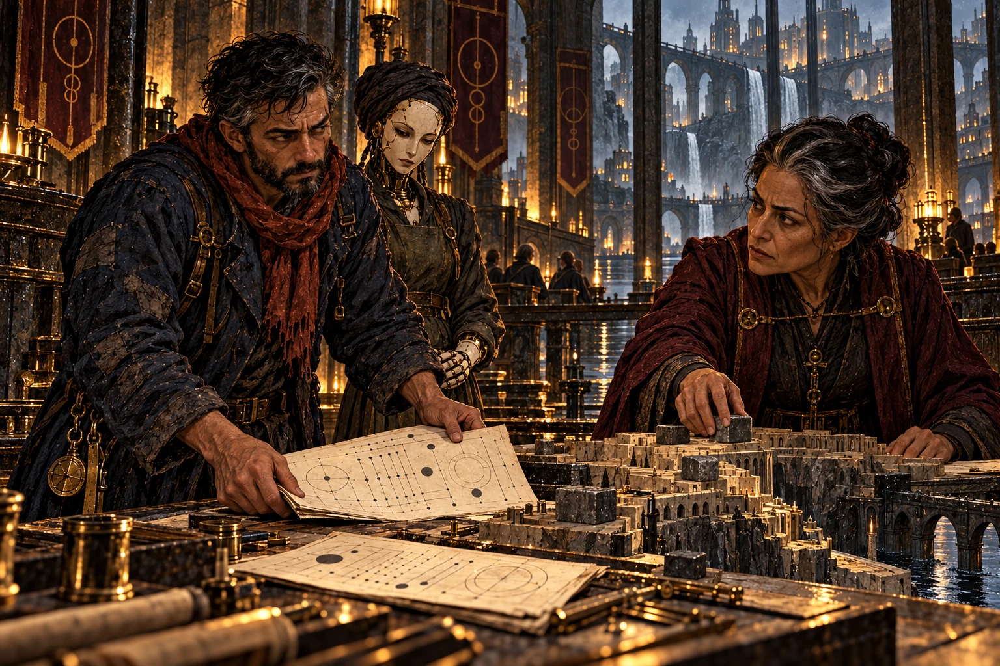
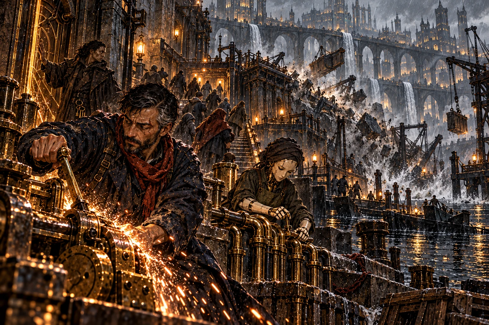
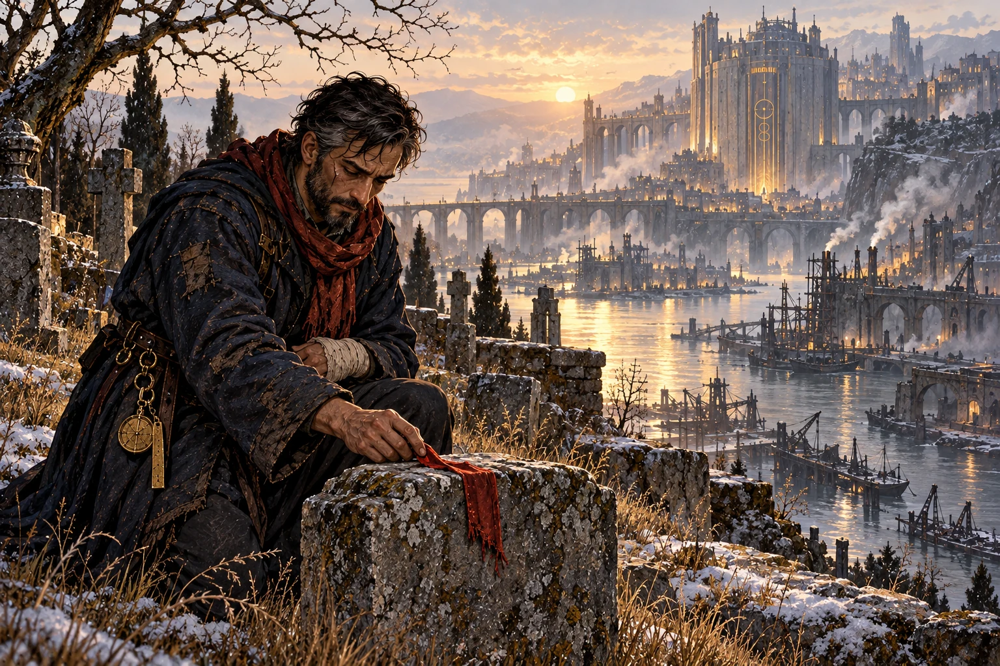

# MONO — Canon V9.4

Version consolidée le 2026-10-09. Source éditoriale : src/data/canon.json.

Les descriptions visuelles sont des interprétations. Les questions ouvertes sont explicitement distinguées des règles établies.

# Avant le Temps

Le Nom, les Sphères et la liberté

## Le Nom avant la parole

Avant qu’il y eût un avant, il y avait le Nom. Il n’avait pas de commencement : rien ne l’avait précédé. Il n’avait pas de lieu : aucun lieu ne pouvait le contenir.

On l’appelle AZKAVOTH. Ce nom est une trace de ce que les êtres peuvent approcher, jamais sa totalité. Une réponse distincte de Lui demandait une place distincte de Lui. Alors le Nom se retira.

## Le Retrait Premier

Il ne créa pas d’abord. Il céda. Là où sa présence se replia, une place devint possible. D’une seule volonté, l’océan du Néant se serra et prit forme. Ce Retrait appartenait à son plan divin et cosmique.

Sept Sphères apparurent : Arel, qui ouvre ; Kethra, qui comprend ; Meryn, qui garde ; Tharos, qui mesure ; Veyra, qui relie ; Oshen, qui montre ; Elyr, qui dure. Chacune contenait la création vue depuis un principe. Ensemble, elles tenaient.

## Les regards d’Éden

Avec les Sphères apparurent sept regards. Ils n’étaient ni des souverains ni des messagers. Ils ne parlaient pas et n’imposaient aucune réponse. Ils voyaient.

Après la Déchirure, leur demeure fut Éden, dans les Cieux. Leur présence demeura secrète aux habitants ordinaires. Ce qu’ils avaient vu avait réellement eu lieu. Leur regard ne promettait pas sa durée ; il empêchait que l’histoire vécue devienne une chose qui n’avait jamais été.

## La Déchirure

Les Sphères portaient des principes qu’aucune forme seule ne pouvait épuiser. Selon le dessein du Nom, leur tenue commune atteignit sa limite. La réalité se fendit. La Déchirure appartenait au même plan que le Retrait ; sa signification entière restait à découvrir.

Les principes formèrent les Cieux ; leurs inversions, les Abysses. La matière mêlée se figea en Terra. Les mortels appelleraient cet événement la Déchirure, et compteraient les années depuis lui. Les trois mondes avaient des natures différentes. Aucun escalier physique ne les réunissait.

## Ce qui fut donné

Les êtres nommeraient quatre Éclats : AZ, la Source ; KA, le Lien ; VO, la Forme ; TH, l’Épanchement. Ils ne décrivaient pas les pièces d’un Dieu brisé. Le Nom demeurait indivisible ; ses créatures recevaient différemment ce qu’elles ne pouvaient contenir.

KA offert lors du Retrait devint le Sillage. VO et TH se déployèrent dans la matière et donnèrent naissance à Vothorak. AZ désignait la Source que ni un support ni un titre ne pouvait posséder. Les cultes naîtraient de ces manières de recevoir et des désaccords qu’elles rendaient possibles.

## Les sept gardes

Sept charges veillèrent sur les principes célestes. Ophriel garda Arel ; Hodariel, Kethra ; Sethariel, Meryn ; Malkiel, Tharos ; Rahamiel, Veyra ; Qerath, Oshen ; Nechariel, Elyr.

Ils pouvaient quitter leurs domaines, mais n’emportaient pas toute leur autorité avec eux. Les anges transmettaient leurs appels. Les mortels pouvaient y répondre, les discuter ou les refuser. Garder la création ne donnait pas le droit de posséder ses habitants.

Une charge ne résumait pas tout l’être qui la portait. Le gardien de la Vision pouvait apprendre et se souvenir sans gouverner les domaines de la Connaissance et de la Mémoire. Les facultés d’une personne et l’autorité d’un territoire demeuraient distinctes.

# Le Banni

Le jugement et les sept épreuves

## Ce que Qerath avait vu

Qerath fit porter une tablette au conseil. Elle confrontait les apports, les retraits et le fluide récupérable de plusieurs réseaux. Les réserves n’étaient pas encore vides ; leurs bilans diminuaient d’une manière que les réparations locales ne suffisaient plus à compenser. Une route coupée n’expliquait pas toutes les pertes. Il posa le relevé devant Hodariel.

« Qu’avons-nous promis aux vivants ? » demanda-t-il. Hodariel répondit que les chiffres demandaient encore une lecture commune. Malkiel voulait que les ateliers et les soigneurs soient avertis. D’autres gardiens craignaient qu’un souverain terrestre saisisse les réserves de son voisin avant même de comprendre le relevé.

« Si nous parlons ce soir, des villes peuvent se battre demain », dit Hodariel. Qerath retourna la tablette. Sur son revers figuraient les charges déjà refusées à des communautés sans défense. « Et si nous nous taisons, qui paie cette nuit ? »

Il ne proposait pas encore le Fond. Il demandait une parole vérifiable, avec les limites des prévisions. Lorsqu’aucune date d’annonce ne fut convenue, il refusa de poursuivre sa charge dans ce silence et déclara qu’il quitterait les Cieux.

## L’apparition

Alors AZKAVOTH se manifesta. Personne ne vit une forme entière. Tous se prosternèrent, tétanisés et fascinés. Qerath lui-même tomba à genoux.

« Qerath, tu es banni des Cieux. Les Abysses seront ton domaine, et tu y gouverneras pour un temps. Le terme de ce temps, je le garde pour Moi. Tu pourras éprouver ce qui fut créé ; tu ne posséderas pas sa réponse. »

Le relevé demeurait au sol. Aucun mot de la parole n’en réfutait les mesures. Qerath reçut une charge dont il n’avait pas demandé les frontières, et les gardiens n’obtinrent pas l’explication entière du jugement.

Le saisissement ne décida pas de leur adhésion intérieure. Certains virent une limite posée à la rupture d’une charge ; Qerath y entendit aussi le prix de son refus. Le terme du règne resta secret. L’interprétation du jugement devint une part du conflit.

## La succession et l’effacement

Tamariel avait appris de Qerath à distinguer la vérité du désir de croire. Il reçut Oshen après son départ. Il reconnaissait les fractures ; il refusait d’en conclure que toute existence devait finir.

Sethariel retira des archives la place ancienne de Qerath et les raisons de sa contestation. Il croyait préserver l’ordre. Il ne pouvait effacer les faits, ni oublier son propre acte. Les Cieux conservèrent une histoire officielle ; les mondes, des traces qui la contredisaient.

Tamariel fit porter aux ateliers des copies des relevés, avec leurs limites. Certains réduisirent leurs pertes ; d’autres virent leurs réserves saisies au nom du danger annoncé. Il contesta les récits qui faisaient naître Qerath dans les Abysses. Mais Oshen ne lui donnait pas les clés des archives de Meryn, et sa parole ne gouvernait pas les cités. Des communautés gardèrent ses pièces ; des autorités refusèrent de les reconnaître. Dire la vérité ouvrait un conflit dont il devait aussi assumer les conséquences.

## Les sept amputations

Qerath descendit dans les territoires abyssaux. Il détacha sa puissance de Passage : Karzuth naquit. Il céda la part du savoir qu’il ne voulait plus porter : Nehrun naquit. Puis vinrent Ymbrath, Bazhur, Sevrak, Ilmoth et Zhorum.

Il ne s’était pas autrefois partagé les sept charges des Cieux. Dans les Abysses qui lui avaient été confiés, il renonçait à la plénitude de facultés dont sa garde de la Vision n’avait jamais été l’unique composante. Les parts devenues personnes reçurent une existence et des domaines propres. Aucun autre gardien ne connaissait de méthode pour répéter cet acte.

Chaque enfant était une part de puissance devenue quelqu’un. Qerath conserva une mémoire et une lucidité blessées ; il ne pouvait plus les exercer dans leur ancienne plénitude. Des souvenirs lui échappaient. Pour atteindre un domaine éloigné, il devait demander un seuil qu’il aurait autrefois ouvert.

Leurs domaines étendaient son règne. Leurs décisions limitaient désormais ses actes. Il leur avait donné une existence, pas un devoir de la lui rendre.

## Le souverain et ses enfants

Karzuth gardait des refuges ; il voulut protéger ses frères. Sevrak prit des domaines qu’il n’entendait pas abandonner. Ilmoth offrit des mondes supportables et apprit à retarder les décisions.

Bazhur voulait aller vite. Nehrun ne voulait pas tout savoir. Ymbrath attendait un aveu. Zhorum portait la fatigue de leur père, mais la décomposition lui montrait parfois une pousse nouvelle. Aucun ne fut simplement la répétition de Qerath.

## Le Fond

Qerath voulait rendre la création au Néant. Son jugement lui avait confié l’Épreuve ; il en tirait désormais la conviction que rien ne méritait de durer.

Le Fond demandait sept restitutions accomplies ensemble. Chacun de ses enfants devait comprendre l’acte et pouvoir encore le refuser. Un ordre exécuté n’aurait pas réuni les parts devenues personnes.

Karzuth avait des refuges à garder ; Sevrak, des domaines ; les autres, des raisons que Qerath ne pouvait plus résumer par son propre désespoir. Même leur accord n’aurait pas été celui des habitants qu’ils auraient condamnés. Le souverain pouvait rechercher l’ouverture ; il ne pouvait l’appeler le consentement de la création.

Nehrun pouvait laisser ses frères discuter ; il ne pouvait leur déléguer sa compréhension de l’acte. Son abstention empêchait sa restitution. Tant qu’il refusait la question, leur volonté commune ne pouvait être réunie.

# La Matière et les Vivants

Le démiurge, Talem et les six lignées

## Le démiurge

Ce récit revient à la matière naissante, avant le bannissement. VO et TH s’y déployèrent ensemble et Vothorak s’éveilla. Le Nom n’avait pas été partagé entre ses créatures ; le démiurge reçut pourtant des traces d’une plénitude dont il ne comprenait pas l’origine.

Il façonna des continents, creusa des profondeurs, établit des formes et des cycles. Les mortels habiteraient son œuvre. Il regarda cette matière qui lui répondait et prit la mémoire du don pour sa propre éternité.

## La Première Forge

Theryn garda ses premières œuvres : figures inachevées, structures sans habitants, formes qui avaient gelé faute de liens. Vothorak y établit la Première Forge.

Il pouvait réorganiser la matière et reproduire ses architectures en les alimentant. Il ne pouvait obtenir une relation libre en serrant davantage une forme. Des peuples seraient sauvés par ses ouvrages ; sa demande de gratitude deviendrait parfois un droit de commande sur leurs descendants.

## La question de Talem

Talem s’éveilla dans une architecture que Vothorak avait préparée. Le démiurge lui désigna l’outil posé près de son bras : la pièce avait été faite pour une fonction précise. Talem observa l’outil, puis les mains de son fabricant. « Qui t’a fait ? »

Vothorak répondit qu’il était le commencement. Talem demanda pourquoi un commencement avait besoin d’être remercié. Le métal de son épaule était encore chaud ; il ne savait ni le réparer ni choisir une autre forme. Il pouvait pourtant poser une question que la Forge n’avait pas prévue.

Lorsqu’il marcha vers la sortie, Vothorak lui rappela les ateliers, les pièces et les relais dont il aurait besoin. Ce n’était pas un mensonge. Talem revint prendre l’outil, puis franchit le seuil. « J’apprendrai. » Le démiurge aurait pu retenir son corps. Il attendit un retour que la force n’aurait pas obtenu.

Talem choisit plus tard de modifier son architecture, puis changea encore au fil des siècles. Certains matériaux portaient des traces dont il ignorait l’origine. Il était devenu coauteur de sa forme ; il ne savait plus toujours distinguer ses souvenirs des inscriptions qu’il avait reçues.

## Le souffle, le sol et la part égale

Autour de la Déchirure, avant que la matière de Terra ait fini de se fixer, les Djinns naquirent du premier souffle de Sillage. Leur fluide portait des impressions des Sphères, pas une histoire exacte que chacun aurait vécue.

Là où le Sillage se concentra dans le sol, les Anakim se levèrent. Ailleurs, il se répartit sans privilégier un principe : les Humains apparurent. Les dispositions ouvraient une pratique ; elles ne remplaçaient pas son apprentissage.

## Ceux qui suivirent Malkiel

Malkiel voyait les mortels payer les décisions prises loin d’eux. Il descendit pour partager leurs conséquences. Ses Veilleurs le suivirent ; ceux qui fondèrent des familles parmi les Humains avaient une existence incarnée. De ces unions naquirent les Néphilim.

Certains héritiers éprouvèrent des échos de la Voix. Les mots reçus ne leur donnaient pas la certitude de leur origine ni le droit de commander. Malkiel continua de circuler entre Terra et les Cieux ; il apprit qu’assumer sans fin la charge d’un autre pouvait dispenser celui-ci de répondre de ses actes.

## Six lignées, des vies libres

Les Golems rejoignirent les Humains, les Djinns, les Anakim et les Néphilim sur Terra. Les Qerathim, descendants des Revers, eurent leurs sept Maisons dans les Abysses et purent franchir les seuils.

Six lignées, aucune condamnation écrite dans le sang ou la matière. Un Qerathim pouvait défaire une emprise ; un Anakim, préserver une tyrannie. Les cinq lignées terrestres coexistèrent longtemps. Leur séparation future viendrait de l’histoire, pas d’une loi de leur nature.

# Les Sceaux et le Voile

Les cultes, la prophétie et le Grand Rite

## Quatre façons de recevoir

Les mortels nommèrent les quatre Éclats du Nom et apprirent quatre manières de recevoir le Sillage. La Source chercha le discernement ; le Lien, les accords ; la Forme, les œuvres ; l’Épanchement, la transmission. Les écoles ne distribuaient pas quatre énergies : toutes conduisaient le même don selon les sept voies.

La Lettre gardait les paroles et les engagements. Le Souffle les éprouvait dans la miséricorde et les vies incarnées. Le Signe travaillait le Nom, le silence et le sens intérieur des signes. Ces trois lectures traversaient les cultes ; elles pouvaient s’accorder dans une ville et se combattre dans une autre.

Un manuscrit transmis, une vie secourue et une expérience intérieure n’étaient pas des preuves identiques. Les gardiens en discutaient l’autorité. Certains protégeaient les lecteurs d’un savoir dangereux ; d’autres protégeaient les privilèges que son secret leur donnait.

Les praticiens conduisaient le fluide dans leurs corps, préparaient des supports ou partageaient les charges. Une circulation compatible n’était pas une adhésion libre. Apprendre à interrompre un effet comptait autant qu’apprendre à l’ouvrir.

## Le Premier Regard

Aurenth grandit autour d’une présence que les pèlerins prenaient pour un être. Le sanctuaire portait l’empreinte du regard d’Éden ; les Témoins eux-mêmes demeuraient tous dans les Cieux.

Les Muets du culte de la Source gardèrent le lieu, les rencontres et les accords. Leur silence demandait d’observer avant de juger. Mais devant une victime, attendre pouvait devenir une faute. La neutralité se construisait par des actes ; elle n’était pas une impossibilité magique de nuire.

## La parole de Sarai

À l’aube de Sarwen, Sarai d’Avarn annonça : « Les Sceaux se rejoindront lorsque personne ne pourra plus les tenir pour siens. »

Les souverains entendirent la promesse d’un Porteur unique. Ils cherchèrent des héritiers, des reliques et des preuves. D’autres y virent un usage partagé. Une prophétie offrait une possibilité et ses conditions ; elle ne retirait à personne la liberté de mal la comprendre.

Une marque copiée et une relique saisie ne suffisaient pas. Chaque Sceau n’avait qu’un support actif ; devenir Porteur ne se déduisait ni d’une naissance ni d’un titre. Les effets pouvaient être examinés, mais un prodige isolé ne prouvait pas leur origine. Une transmission exigeait davantage que le récit de ceux qui la revendiquaient.

## Eshar et le salut imposé

Eshar avait stabilisé des Brisures et sauvé des régions. Au seuil du Grand Rite, ses anciens succès donnaient du poids à ses ordres. Les quatre Sceaux étaient réunis ; les supports et les participants devaient accorder des charges que personne n’avait encore tenues ensemble.

Une gardienne demanda de réduire la circulation de son groupe. Les canaux étaient à leur limite. Eshar regarda les régions qu’un délai laisserait sans secours. « Si nous interrompons maintenant, qui leur répondra ? » Il ordonna que les relais maintiennent toutes les contributions.

Le retrait avait cessé d’être possible. Les corps et les ouvrages conduisirent encore, mais l’ordre ne fit pas de leurs tensions un accord. Une surcharge courut vers les supports voisins ; fermer un relais aurait reporté sa charge sur ceux qui tenaient encore.

Eshar tenta de ramener les écarts à une seule mesure. Les ancrages cédèrent là où les différences ne pouvaient plus circuler. La fracture s’aggrava. Il avait voulu sauver les vies en retirant à leurs gardiens la possibilité de dire que l’opération devait s’arrêter.

Les passages se dégradèrent et le Voile commença. Son nom fut ensuite retiré de nombreuses chroniques. Son acte et son échec sont établis ; son sort et l’ensemble des décisions du Rite ne le sont pas.

## Le Voile

Après le Rite, les passages devinrent dangereux. Des échanges cessèrent, des communautés se replièrent et les peuples se regroupèrent. Des siècles transformèrent ces choix en habitudes continentales.

Aucune frontière ne fut inscrite dans une lignée. Les héritiers d’anciennes cohabitations gardèrent des récits, des langues et des liens que le Voile n’avait pas entièrement rompus. Leur histoire détaillée restait à reconstruire.

## L’Éveil des Brisures

À partir de CD 12600, les Brisures se multiplièrent. À mesure que le Sillage disponible diminuait, les relations entre les dimensions devenaient instables. Leurs tensions concentraient localement le fluide ; des lieux de Terra rencontrèrent les dimensions métaphysiques.

Vothorak voulait préserver son œuvre. Qerath voulait la rendre. La Concorde demandait une réparation que nul ne pouvait imposer seul. Entre eux, des êtres de six lignées devaient encore décider quelles vies protéger, quels ouvrages maintenir et quelles dettes reconnaître.

À Aurenth, dans les premières années de l’Éveil, un seuil de protection se mit à rendre l’écho d’une pièce qui n’existait pas dans ses plans. Sava arrêta la charge de son outil. Derrière le mur, des habitants attendaient que l’on ouvre la porte. L’atelier avait refusé le nouvel apport tant que son contrat ne serait pas reconnu.

Maëra posa deux copies sur la table. L’une donnait un terme aux droits de maintenance ; l’autre liait aussi les descendants. Elle connaissait la main qui avait négocié la première. Sur la seconde, elle n’avait pas encore établi qui avait prolongé la dette. Elle écrivit : « On peut contester cette pièce. » Sava répondit : « Le mur n’attendra pas le jugement. »

Iri entra avec le document de retenue du convoi. Son frère était encore sur la route. « Je peux ouvrir un passage pour quelques personnes. Je ne peux pas faire venir leurs caisses. » Sava lui montra un seuil préparé de l’autre côté de la cour. Le sauver engagerait la réserve qui devait alimenter son prochain départ.

Maëra refusa d’apposer le cachet de la cité sur la copie contestée. Elle signa une demande de secours distincte, qui conservait le litige, et en fit remettre une copie aux habitants. Iri engagea une part de sa réserve. Sava répartit les charges sur les supports inspectés ; personne ne promit de tenir au-delà du signal d’arrêt.

Le passage permit une évacuation partielle. Quand un support commença à céder, elles interrompirent l’effet au lieu de le reporter sur les corps. Un dépôt fut endommagé et des habitants durent attendre les secours par la cour. Les relevés avaient été mis à l’abri ; les matériaux du relais, eux, étaient perdus.

À l’aube, le quartier pouvait être secouru par une autre entrée. Le convoi restait retenu, la réserve d’Iri était réduite et l’atelier réclamait le prix des supports. Maëra publia les deux copies. Sava ajouta le bilan de leur intervention, y compris les pertes. Elles avaient empêché une aggravation ; elles n’avaient ni résolu la dette ni expliqué la Brisure.

# La ville qui refusait ses morts

Premier arc · Le Voile, vers CD 12100

## Le lendemain

*Serekh · Un acte préparé pour une mort qui n’a pas encore eu lieu.*

Oran reçut son acte de décès un jeudi de pluie. La date était celle du vendredi. Sous son nom, quelqu’un avait imprimé son propre cachet.

Le garçon qui avait apporté la caisse attendait encore sur le seuil. Oran lui demanda où se trouvait le corps. Le garçon regarda ses bottes. Il ne connaissait que le trajet, la porte et la pièce de cuivre qu’on lui avait promise. Oran le paya. Il le regarda courir entre les gouttes, avec cette colère absurde contre les jambes d’un autre qui savaient encore partir.

Dans la caisse, à côté de l’acte, il y avait une bande de laiton et un morceau de ruban rouge. Oran ne toucha pas le ruban. Il connaissait le point cousu à son bord : une reprise maladroite, faite sept ans plus tôt par sa fille pour empêcher l’étoffe de se défaire. Il avait enterré ce ruban avec elle. Du moins, c’était ce qu’il avait cru.

Il gagnait sa vie à fermer les comptes des morts. Il vérifiait un nom, un corps, des témoins ; puis il rompait le cachet qui permettait à une dette de maintenance de rester attachée à un foyer. Il ne parlait pas aux âmes. Il savait seulement ce qu’une famille risquait lorsqu’une administration refusait de reconnaître une mort.

Serekh avait été bâtie dans une gorge de Khoram, autour d’une rivière noire et de terrasses qu’un réseau d’ouvrages empêchait de glisser. Trois cents ans avaient passé depuis le Grand Rite d’Eshar. Les grands passages demeuraient incertains. Ici, on entretenait les vieux relais parce qu’on n’avait pas d’autre ville où aller.

Sur l’acte figurait une cause : accident de conduction. Une heure : la neuvième. Un lieu : la Chambre des Restes. L’autorisation portait le contre-cachet du greffe. Ce n’était pas une vision. Quelqu’un avait préparé un dossier dont il attendait que le monde remplisse les cases.

Oran sortit sa chaîne de mesure. La dernière empreinte de son outil possédait une bavure ; il l’avait laissée exprès, pour reconnaître les copies. La bavure était là. On n’avait pas volé le cachet. On avait restitué l’une de ses anciennes empreintes dans un support préparé.

À midi, les cloches d’entretien sonnèrent sous la pluie. Elles n’annonçaient pas un office : le quartier bas devait régler sa contribution. Des ouvriers sortirent leurs bracelets de conduite. Une femme referma le manteau de son fils sur le sien.

Oran replia l’acte et prit la bande de laiton. Au dos, trois mots avaient été gravés à la pointe : Faites-la écouter. Il posa le ruban dans la poche intérieure de son manteau. Avant de partir, il barra sur son registre l’heure à laquelle il avait promis de fermer les comptes. Pour la première fois depuis sept ans, il ne savait plus lesquels.

## Ce qui reste d’une voix

*L’atelier de Tess · Une trace alimentée restitue une voix ; elle ne rappelle pas une âme.*

Tess reconnut la bande avant de reconnaître Oran. Ses doigts de bronze cessèrent de classer les pièces. Elle avait le visage d’une porcelaine réparée tant de fois que les jointures formaient une seconde expression, plus méfiante que la première.

« Tu l’as envoyée », dit-il. Elle posa une chaise entre eux. « Si je t’avais appelé, tu aurais demandé un ordre du greffe. » Il ne répondit pas. Ils avaient déjà eu cette conversation, sept ans plus tôt, avec un lit derrière la porte et sa fille dessus.

Le ruban était resté parmi les effets retenus par le greffe, au lieu de rejoindre le cercueil. Tess l’avait retrouvé dans la même boîte que la bande. Oran n’avait pas demandé à voir le paquet remis aux fossoyeurs. Cette négligence minuscule lui revint avec une précision qui le blessa presque autant que le reste.

Tess réparait les bracelets et les supports des ateliers. La bande venait d’un dispositif de Meryn : elle avait reçu une voix pendant qu’elle avait encore un corps pour parler. Rien de plus. Une réserve préparée permettrait de restituer quelques secondes. Après, il faudrait l’alimenter à nouveau. Aucun mort ne recevrait leurs questions.

Elle ouvrit un logement dans l’établi, inspecta le canal, puis prévint Oran que la trace pouvait être incomplète. Il acquiesça sans l’écouter. Quand la voix revint, il reconnut d’abord un souffle impatient, celui que Lise retenait avant de lui dire qu’il avait oublié quelque chose.

« Père, le huitième relais ne tient pas. J’ai demandé l’arrêt. Ils disent que la fermeture emportera l’hospice. Je ne veux pas quitter les malades. Je veux qu’on change la charge. Tu m’entends ? »

Le logement redevint silencieux. Oran attendit. Il avait passé sept ans à imaginer une dernière parole plus douce. Tess lui laissait la place de recevoir celle qui avait vraiment été dite.

Lise s’était engagée comme soigneuse. Le soir de l’accident, une terrasse avait commencé à céder ; trois salles de l’hospice dépendaient de la protection. Oran avait autorisé huit heures de conduction supplémentaires. Sur le registre officiel, la surcharge était survenue avant toute demande d’arrêt. Il avait signé ce registre aussi.

« Tu savais ? » Tess rapprocha de lui la bande. « J’avais entendu une demande. Je n’avais pas la pièce qui prouvait qu’elle avait été reçue. La Chambre des Restes a enregistré les deux côtés du canal. » Oran regarda sa main. La voix de sa fille n’était pas une accusation nouvelle. Elle rendait une ancienne certitude impossible.

Tess lui montra un second objet : le numéro d’entretien retiré de son propre bras. Dans les comptes de Serekh, son corps appartenait encore à l’atelier qui avait payé sa dernière réparation. Elle pouvait marcher dehors ; elle ne pouvait acheter les pièces dont ses canaux avaient besoin sans renouveler cet engagement.

« Si nous détruisons les registres, dit Oran, leurs titres disparaissent. — Les plans aussi. Et les gardes savent trouver nos maisons sans papier. » Tess ne lui proposait pas une purification. Elle voulait les comptes entiers, avec les plans et les demandes d’arrêt, avant la révision annoncée pour le lendemain.

Elle avait copié son acte préparé dans une liasse de maintenance. L’accident prévu clôturerait sa responsabilité et ferait de l’inspection un dossier déjà réglé. Quelqu’un comptait sur sa mort ; personne ne connaissait encore la façon dont on la provoquerait. Oran rangea la bande. « Qui peut nous faire entrer ? » Tess tourna vers lui une clé carrée. « Quelqu’un à qui tu as refusé des morts. »

## La porte qui protège

*La Chambre des Restes · Les morts ne conduisent rien. Les vivants paient sous leurs noms.*

Le refuge de Veyl n’avait pas de cloche. On frappait trois fois, puis on attendait que quelqu’un observe par la fente. Le battant était large, les gonds doublés. Quand la rivière montait, fermer cette porte sauvait ceux qui étaient dedans. Ceux qui attendaient dehors le savaient aussi.

Veyl portait sur le visage de fines fissures pâles et, sur son manteau, les marques d’anciens fermoirs. Il descendait de la Maison de Karzuth. Cette origine ne disait ni ce qu’il avait fait ni ce qu’il ferait. Oran connaissait la première chose : Veyl avait accueilli des familles dont la ville ne voulait pas fermer les comptes.

« Je t’ai apporté un acte », dit Oran. Veyl le lut, regarda la date et lui rendit la feuille. « Tu viens parce que le tien est faux. » Oran sentit sa première défense lui monter à la bouche. Il la ravala. « Oui. »

Veyl les conduisit sous les terrasses par une galerie d’entretien. Il n’avait pas créé un passage : il avait obtenu une clé et préparé deux fermetures. À la première alerte, il pourrait contenir une poursuite. Il ne pourrait pas soutenir indéfiniment la poussée de l’eau contre les portes.

La Chambre des Restes s’étendait dans l’espace évidé sous les quais. Des plaques d’ivoire pendaient aux rails de cuivre, entre les ponts d’entretien. Chaque nom avait un foyer, une réserve et une contribution associés. L’eau reflétait leurs alignements jusqu’à donner l’impression que la ville reposait sur une population retournée.

Tess compara les numéros. Les personnes mortes demeuraient ouvertes dans les comptes. Leurs contributions n’étaient pas fournies par des cadavres : on les prélevait sur les foyers restants. Les héritiers continuaient de tenir des charges que les registres attribuaient à un don ancien, renouvelé pour la sécurité commune. Les bracelets et les gardes faisaient le reste.

Oran trouva Lise. Sa plaque portait une marque de réengagement ajoutée après sa mort. En dessous, la pièce de décision conservait son propre cachet. Il avait accepté de reporter la clôture des comptes du quartier pendant la remise en état. On lui avait dit : une semaine. Les travaux n’avaient jamais été déclarés finis.

Un autre feuillet précisait que les demandes d’arrêt n’avaient pas été transmises. Oran sentit le froid lui serrer les tempes. Tess trouva la contre-trace du canal. L’appel de Lise était arrivé à son poste. Il se souvenait maintenant du levier sous sa paume, des lits dessinés sur le plan et de sa décision d’attendre encore quelques minutes.

« Je l’ai entendu », dit-il. Tess ne détourna pas les yeux. Veyl posa sa lampe assez loin pour que les trois puissent voir la pièce. « Alors on emporte aussi celle-là. »

Oran avait imaginé revenir avec une preuve qui laverait sa fille et le laisserait intact. Il détacha le feuillet portant son ordre. Une inscription du passé ne pouvait être défaite en refusant de la regarder. Il copia les numéros de dépôt ; Tess prépara les traces qu’ils pourraient réellement alimenter devant témoins.

La première porte claqua au-dessus d’eux. Des bottes frappèrent la galerie. Veyl posa les deux mains sur le fermoir intérieur. « Prenez les plans. » Oran voulut l’aider. « Tu tiendras mieux une feuille qu’une porte », dit Veyl. Ce n’était pas du mépris. C’était la mesure exacte de ce qu’il savait faire.

## Le prix des vivants

*Le tribunal d’entretien · Sauver une ville ne donne pas un droit sans terme sur ses habitants.*

Ils sortirent par un quai de réparation. Veyl avait abandonné une porte pour sauver l’autre ; la fuite avait rempli la galerie derrière eux. Son refuge perdait l’accès qui permettait aux ateliers de livrer les provisions. Il refusa de laisser Oran appeler cela un simple dommage matériel.

Edrane les attendait au tribunal d’entretien. Elle avait exercé dans l’hospice avant de prendre la charge de magistrate. Sur sa table, les modèles des terrasses étaient lestés de petites pierres. Oran savait ce que chacun de ces poids représentait. Il avait appris à ne plus y voir des lits.

Elle ne nia pas les prolongations. « La ville d’en haut a refusé trois apports. Les ateliers de l’extérieur réclamaient nos plans en garantie. Le quartier bas a tenu. » Tess posa le feuillet de Lise. « Il n’a pas tenu tout seul. »

Edrane regarda la pièce, puis Oran. « Tu as signé. » Il répondit oui. Le mot ne le délivra de rien. Il rendit seulement plus difficile la possibilité de parler ensuite comme un homme qui aurait découvert la faute des autres.

Le greffe avait préparé sa clôture avant sa visite à la Chambre. Oran demanda si l’accident annoncé était un ordre de le tuer. Edrane fit venir le commis responsable. Il reconnut avoir traité comme acquise l’issue d’une intervention jugée sans retour, afin de retirer l’inspecteur des comptes avant la révision. Une escouade avait reçu ordre de le ramener au relais. Personne ne promit qu’il en sortirait. Edrane suspendit cet ordre. Oran ne sut pas si elle venait d’empêcher un meurtre ou d’éloigner de sa table une preuve supplémentaire.

« Donnez-moi les copies, dit-elle. Je fermerai le nom de Lise et ton compte. » Il aurait pu rentrer avec une tombe entière et l’affirmation que sa vie lui appartenait de nouveau. Derrière lui, Tess tenait son bras réparé contre sa poitrine. Veyl ne s’était pas assis.

« Et les autres ? — Si nous retirons toutes les contributions aujourd’hui, la protection cède. Tu connais les plans. » Edrane poussa vers lui le modèle du quartier bas. Elle disait vrai sur les charges. Cette vérité avait servi à rendre les mêmes corps indispensables pendant sept ans.

Oran consulta le bilan de Tess. Les terrasses hautes avaient gardé une réserve de précaution et des ouvrages de prestige pendant que les foyers bas renouvelaient leurs journées. La réduire ne sauverait pas tout ; elle donnerait le temps d’évacuer plusieurs rues et de remplacer certains supports. Edrane répondit que le conseil ne l’autoriserait pas.

« Alors qu’il refuse devant ceux qu’il veut laisser tenir », dit Oran. Il demanda une audience ouverte et une répartition publiée. Il ne demandait pas aux gardes d’attendre l’accord de chaque habitant avant de protéger un mur. Il leur demandait de ne plus appeler contribution libre une charge dont personne ne pouvait sortir.

Edrane tarda à répondre. Au loin, une cloche sonna une fois, puis resta suspendue dans son silence. La révision des comptes avait commencé à déplacer les circulations du vieux réseau. Un relais venait de sortir de sa plage. La magistrate prit le modèle et se leva. « Venez me montrer les rues que vous pouvez sauver. »

## L’heure d’arrêter

*Le réseau bas · Une limite annoncée doit pouvoir devenir un arrêt réel.*

Les ouvriers n’applaudirent pas quand Oran arriva. Ils regardèrent le cachet à sa ceinture. Plusieurs se souvenaient des huit heures supplémentaires. Il leur dit que l’appel avait été reçu, qu’il avait retardé l’arrêt et que les copies seraient déposées hors du greffe. Une femme demanda le nom du dépôt avant de croire le reste.

Edrane fit ouvrir la réserve haute pour l’évacuation. Elle signa l’ordre et en remit une copie au représentant du quartier. Le conseil pourrait la poursuivre pour cet usage. Il pourrait aussi lire les charges qu’elle avait accepté de maintenir jusque-là. Elle ne réclama pas qu’un acte efface l’autre.

Tess répartit les opérations sur les supports inspectés. Les appareils d’Elyr devaient tenir les joints ; les réglages de Tharos, partager une charge précise. Les équipes annoncèrent ce qu’elles pouvaient conduire et le temps qu’elles estimaient tenir. Veyl prépara l’enceinte qui contiendrait les débris pendant le passage des familles. Sa porte ne serait pas une sortie : deux escaliers demeuraient à dégager.

Oran resta au poste des signaux. Il connaissait les réponses du réseau et la manière dont un ordre pouvait se perdre entre deux bureaux. Il fit répéter le geste d’arrêt, puis demanda qu’un second poste le voie. Sa réserve n’aurait pas soutenu une terrasse. Ses outils pouvaient maintenir une transmission étroite, tant que le canal restait accessible.

La première rue fut vidée. Dans la deuxième, un vieil homme refusa de quitter son atelier avant d’avoir récupéré un coffre. Un voisin revint l’aider. Le relais ne savait rien de leurs raisons ; sa charge augmentait quand même. Tess annonça une dérive. Edrane ordonna que l’on cesse de faire entrer des groupes sur le pont supérieur.

Puis une traverse céda derrière Veyl. Il demanda de reprendre sa contribution. Il pouvait tenir encore un choc, pas le suivant. La réserve haute n’avait pas le débit nécessaire pour remplacer aussitôt cette prise. On pouvait attendre : quelques familles supplémentaires atteindraient l’escalier. On pouvait arrêter : le quai serait perdu.

Oran vit la même hésitation qu’autrefois, rendue presque raisonnable par ceux qui n’étaient pas encore sortis. Il n’entendit aucune voix de sa fille. Il entendit celle de Veyl, vivant, qui avait décrit sa limite.

Il donna le signal d’arrêt. Le second poste le répéta. Tess ramena la charge vers les supports préparés pour la recevoir. Un joint rompu projeta de la chaleur à travers le levier ; Oran lâcha trop tard. Sa main gauche se referma sans lui. Il resta au poste avec la droite et confirma l’interruption.

L’enceinte de Veyl s’ouvrit dans la direction prévue pour les débris. Le quai descendit dans l’eau avec trois ateliers, des outils et une partie des registres dont les copies avaient été faites. Le vieil homme et son voisin sortirent par l’escalier inférieur, blessés. Un garde manquait encore. On retrouva son corps à la nuit. Aucun bilan ne rendrait cela acceptable à sa famille.

La ville tint sur un réseau réduit. Des rues ne pourraient pas être réoccupées. Tess coupa l’alimentation de son propre logement pour soutenir un abri collectif pendant le froid. Elle demanda qu’on inscrive la durée et que quelqu’un lui rappelle l’heure d’arrêter. Cette fois, Oran fit porter la copie à ceux qui dormiraient sous sa protection.

## Une place pour les absents

*Après l’hiver · Reconnaître une mort ne rend pas celui qu’on a perdu.*

Le vendredi passa sans qu’Oran meure. L’acte préparé fut conservé avec la déclaration du commis et les ordres de l’escouade. Ce qui n’avait pas eu lieu constituait désormais la preuve de ce que certains avaient accepté de traiter comme décidé.

On ouvrit les comptes sous les halles hautes, où les ateliers ne possédaient pas seuls les clés. Fermer les noms des morts ne rendait pas le Sillage consumé et ne réparait pas les quais. Les foyers n’en reçurent pas moins un droit qu’on leur avait refusé : discuter les nouvelles contributions sans qu’une voix enregistrée de leur parent passe pour leur accord.

Oran fit inscrire Lise avec sa date de mort réelle. Le feuillet de sa demande d’arrêt fut joint au sien. Il demanda aussi l’inscription de sa propre décision et des prolongations qu’il avait autorisées. Le greffier lui proposa de séparer les pièces pour épargner les familles. Oran demanda aux familles ce qu’elles voulaient. Certaines exigèrent tout. D’autres refusèrent d’entendre les voix. On conserva leurs refus sans retirer les preuves du dépôt.

Le nom du garde mort au quai fut ajouté. Sa sœur ne voulut pas serrer la main d’Oran. Il la laissa partir. Il avait empêché une répétition ; il n’était pas devenu innocent de tout ce qui avait suivi.

Edrane perdit provisoirement sa charge pendant l’examen des comptes. Plusieurs soutiens du conseil parlèrent de sabotage. Les ateliers voulurent garder les procédés de réparation hors du dépôt. Tess obtint qu’une équipe indépendante inspecte les supports, puis dut négocier l’accès aux pièces qui la maintenaient en état. Veyl réclama une route de livraison pour son refuge. Chacun avait autre chose à faire que de servir la fin de l’histoire d’Oran.

La main gauche d’Oran ne retrouva pas sa précision. Il pouvait tenir une tasse ; il ne pouvait plus régler seul certains tracés. Une jeune ouvrière vint l’aider à recopier les actes. Il dut lui apprendre sa méthode et accepter qu’elle corrige ses mesures.

À la fin de l’hiver, il porta le ruban au cimetière. La tombe de Lise n’avait pas changé de place. Il ne déposa pas la bande de mémoire dans la terre : elle faisait partie des preuves communes, et il n’en était pas le seul destinataire. Il posa seulement le ruban sur la pierre.

Il avait longtemps demandé à ce lieu une parole qui lui permettrait de repartir. Cette fois, il n’en attendit aucune. Le vent souleva un bord de l’étoffe ; il le rabattit avec sa main droite et resta jusqu’à ce que ses doigts aient froid.

Sur le chemin du retour, Tess lui remit une feuille venue d’un atelier extérieur. Des comptes de maintenance portaient le même dispositif de prolongation que ceux de Serekh. Il y avait des noms, une provenance et une demande d’inspection. Rien qui prouvât encore une faute. Oran demanda les conditions du voyage, puis le temps dont les autres auraient besoin pour préparer leur réponse.

Il ne promit pas de réparer tous les mondes. Il prit la feuille.
