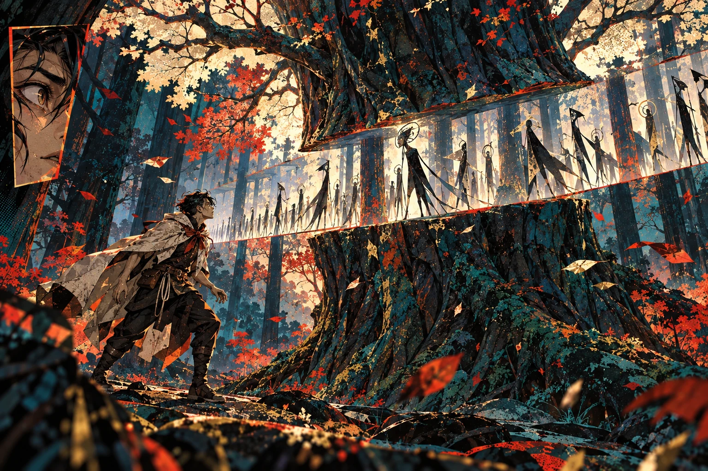
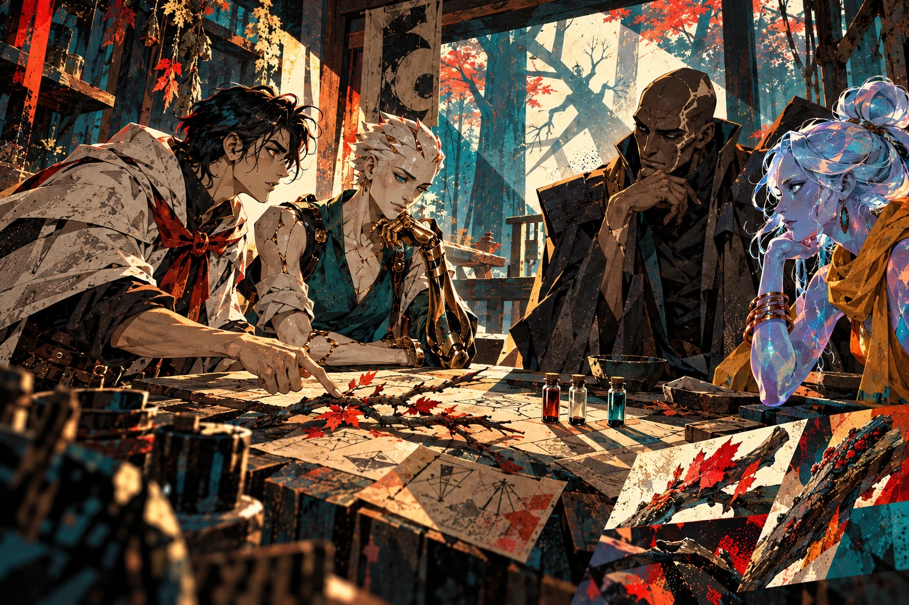
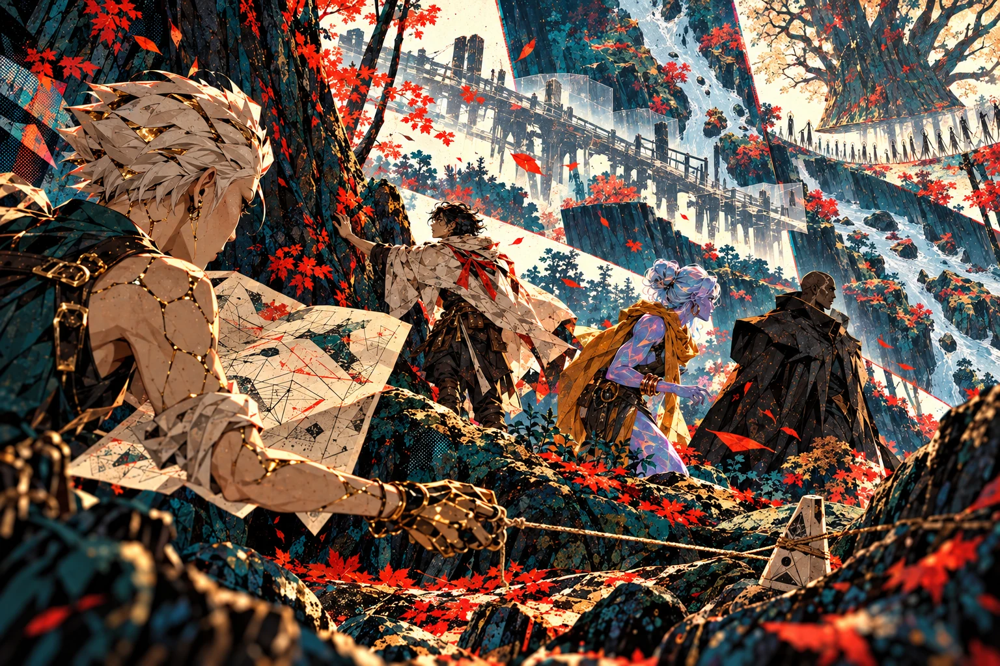
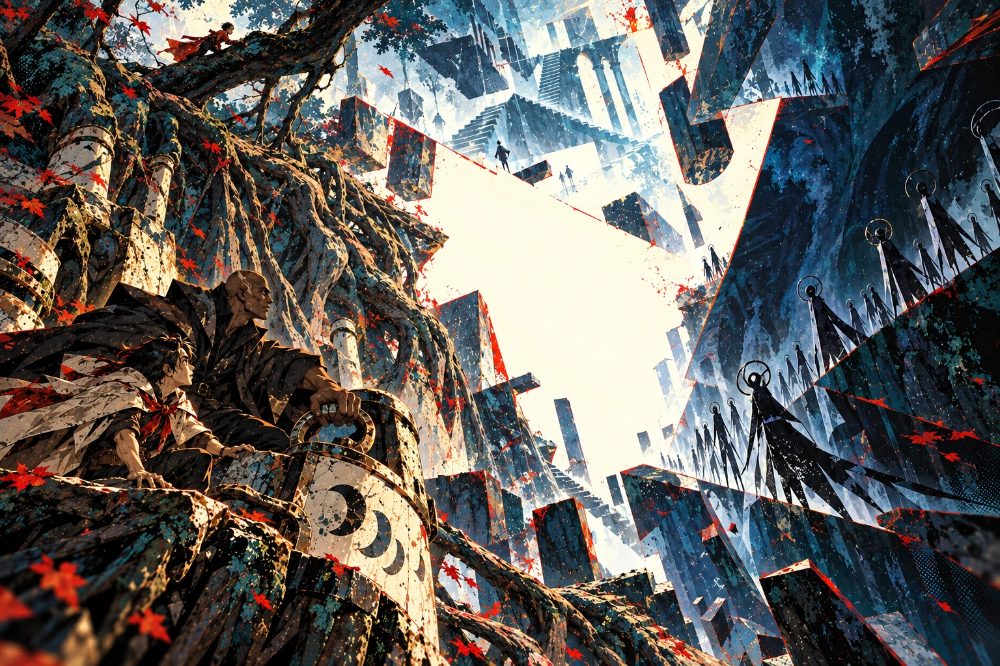
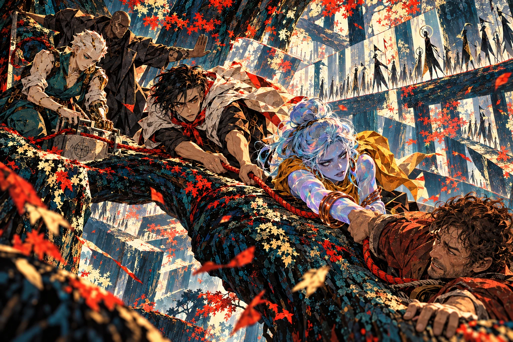
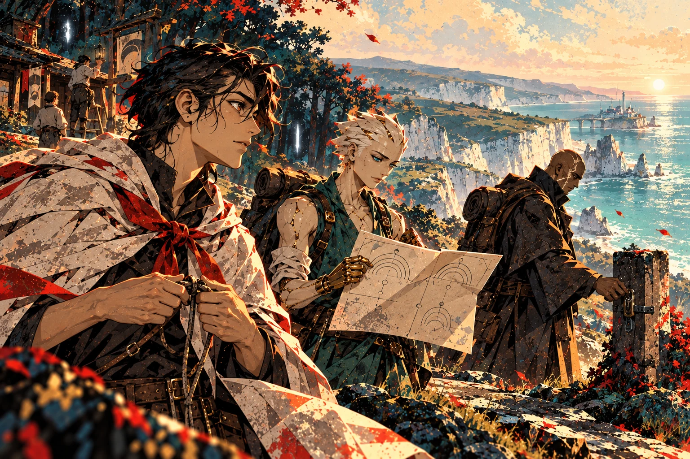

# MONO — Canon V9.4

Version consolidée le 2026-10-09. Source éditoriale : src/data/canon.json.

Les descriptions visuelles sont des interprétations. Les questions ouvertes sont explicitement distinguées des règles établies.

# Avant le Temps

Le Nom, les Sphères et la liberté

## Le Nom avant la parole

Avant qu’il y eût un avant, il y avait le Nom. Il n’avait pas de commencement : rien ne l’avait précédé. Il n’avait pas de lieu : aucun lieu ne pouvait le contenir.

On l’appelle AZKAVOTH. Ce nom est une trace de ce que les êtres peuvent approcher, jamais sa totalité. Une réponse distincte de Lui demandait une place distincte de Lui. Alors le Nom se retira.

## Le Retrait Premier

Il ne créa pas d’abord. Il céda. Là où sa présence se replia, une place devint possible. D’une seule volonté, l’océan du Néant se serra et prit forme. Ce Retrait appartenait à son plan divin et cosmique.

Sept Sphères apparurent : Arel, qui ouvre ; Kethra, qui comprend ; Meryn, qui garde ; Tharos, qui mesure ; Veyra, qui relie ; Oshen, qui montre ; Elyr, qui dure. Chacune contenait la création vue depuis un principe. Ensemble, elles tenaient.

## Les regards d’Éden

Avec les Sphères apparurent sept regards. Ils n’étaient ni des souverains ni des messagers. Ils ne parlaient pas et n’imposaient aucune réponse. Ils voyaient.

Après la Déchirure, leur demeure fut Éden, dans les Cieux. Leur présence demeura secrète aux habitants ordinaires. Ce qu’ils avaient vu avait réellement eu lieu. Leur regard ne promettait pas sa durée ; il empêchait que l’histoire vécue devienne une chose qui n’avait jamais été.

## La Déchirure

Les Sphères portaient des principes qu’aucune forme seule ne pouvait épuiser. Selon le dessein du Nom, leur tenue commune atteignit sa limite. La réalité se fendit. La Déchirure appartenait au même plan que le Retrait ; sa signification entière restait à découvrir.

Les principes formèrent les Cieux ; leurs inversions, les Abysses. La matière mêlée se figea en Terra. Les mortels appelleraient cet événement la Déchirure, et compteraient les années depuis lui. Les trois mondes avaient des natures différentes. Aucun escalier physique ne les réunissait.

## Ce qui fut donné

Les êtres nommeraient quatre Éclats : AZ, la Source ; KA, le Lien ; VO, la Forme ; TH, l’Épanchement. Ils ne décrivaient pas les pièces d’un Dieu brisé. Le Nom demeurait indivisible ; ses créatures recevaient différemment ce qu’elles ne pouvaient contenir.

KA offert lors du Retrait devint le Sillage. VO et TH se déployèrent dans la matière et donnèrent naissance à Vothorak. AZ désignait la Source que ni un support ni un titre ne pouvait posséder. Les cultes naîtraient de ces manières de recevoir et des désaccords qu’elles rendaient possibles.

## Les sept gardes

Sept charges veillèrent sur les principes célestes. Ophriel garda Arel ; Hodariel, Kethra ; Sethariel, Meryn ; Malkiel, Tharos ; Rahamiel, Veyra ; Qerath, Oshen ; Nechariel, Elyr.

Ils pouvaient quitter leurs domaines, mais n’emportaient pas toute leur autorité avec eux. Les anges transmettaient leurs appels. Les mortels pouvaient y répondre, les discuter ou les refuser. Garder la création ne donnait pas le droit de posséder ses habitants.

Une charge ne résumait pas tout l’être qui la portait. Le gardien de la Vision pouvait apprendre et se souvenir sans gouverner les domaines de la Connaissance et de la Mémoire. Les facultés d’une personne et l’autorité d’un territoire demeuraient distinctes.

# Le Banni

Le jugement et les sept épreuves

## Ce que Qerath avait vu

Qerath fit porter une tablette au conseil. Elle confrontait les apports, les retraits et le fluide récupérable de plusieurs réseaux. Les réserves n’étaient pas encore vides ; leurs bilans diminuaient d’une manière que les réparations locales ne suffisaient plus à compenser. Une route coupée n’expliquait pas toutes les pertes. Il posa le relevé devant Hodariel.

« Qu’avons-nous promis aux vivants ? » demanda-t-il. Hodariel répondit que les chiffres demandaient encore une lecture commune. Malkiel voulait que les ateliers et les soigneurs soient avertis. D’autres gardiens craignaient qu’un souverain terrestre saisisse les réserves de son voisin avant même de comprendre le relevé.

« Si nous parlons ce soir, des villes peuvent se battre demain », dit Hodariel. Qerath retourna la tablette. Sur son revers figuraient les charges déjà refusées à des communautés sans défense. « Et si nous nous taisons, qui paie cette nuit ? »

Il ne proposait pas encore le Fond. Il demandait une parole vérifiable, avec les limites des prévisions. Lorsqu’aucune date d’annonce ne fut convenue, il refusa de poursuivre sa charge dans ce silence et déclara qu’il quitterait les Cieux.

## L’apparition

Alors AZKAVOTH se manifesta. Personne ne vit une forme entière. Tous se prosternèrent, tétanisés et fascinés. Qerath lui-même tomba à genoux.

« Qerath, tu es banni des Cieux. Les Abysses seront ton domaine, et tu y gouverneras pour un temps. Le terme de ce temps, je le garde pour Moi. Tu pourras éprouver ce qui fut créé ; tu ne posséderas pas sa réponse. »

Le relevé demeurait au sol. Aucun mot de la parole n’en réfutait les mesures. Qerath reçut une charge dont il n’avait pas demandé les frontières, et les gardiens n’obtinrent pas l’explication entière du jugement.

Le saisissement ne décida pas de leur adhésion intérieure. Certains virent une limite posée à la rupture d’une charge ; Qerath y entendit aussi le prix de son refus. Le terme du règne resta secret. L’interprétation du jugement devint une part du conflit.

## La succession et l’effacement

Tamariel avait appris de Qerath à distinguer la vérité du désir de croire. Il reçut Oshen après son départ. Il reconnaissait les fractures ; il refusait d’en conclure que toute existence devait finir.

Sethariel retira des archives la place ancienne de Qerath et les raisons de sa contestation. Il croyait préserver l’ordre. Il ne pouvait effacer les faits, ni oublier son propre acte. Les Cieux conservèrent une histoire officielle ; les mondes, des traces qui la contredisaient.

Tamariel fit porter aux ateliers des copies des relevés, avec leurs limites. Certains réduisirent leurs pertes ; d’autres virent leurs réserves saisies au nom du danger annoncé. Il contesta les récits qui faisaient naître Qerath dans les Abysses. Mais Oshen ne lui donnait pas les clés des archives de Meryn, et sa parole ne gouvernait pas les cités. Des communautés gardèrent ses pièces ; des autorités refusèrent de les reconnaître. Dire la vérité ouvrait un conflit dont il devait aussi assumer les conséquences.

## Les sept amputations

Qerath descendit dans les territoires abyssaux. Il détacha sa puissance de Passage : Karzuth naquit. Il céda la part du savoir qu’il ne voulait plus porter : Nehrun naquit. Puis vinrent Ymbrath, Bazhur, Sevrak, Ilmoth et Zhorum.

Il ne s’était pas autrefois partagé les sept charges des Cieux. Dans les Abysses qui lui avaient été confiés, il renonçait à la plénitude de facultés dont sa garde de la Vision n’avait jamais été l’unique composante. Les parts devenues personnes reçurent une existence et des domaines propres. Aucun autre gardien ne connaissait de méthode pour répéter cet acte.

Chaque enfant était une part de puissance devenue quelqu’un. Qerath conserva une mémoire et une lucidité blessées ; il ne pouvait plus les exercer dans leur ancienne plénitude. Des souvenirs lui échappaient. Pour atteindre un domaine éloigné, il devait demander un seuil qu’il aurait autrefois ouvert.

Leurs domaines étendaient son règne. Leurs décisions limitaient désormais ses actes. Il leur avait donné une existence, pas un devoir de la lui rendre.

## Le souverain et ses enfants

Karzuth gardait des refuges ; il voulut protéger ses frères. Sevrak prit des domaines qu’il n’entendait pas abandonner. Ilmoth offrit des mondes supportables et apprit à retarder les décisions.

Bazhur voulait aller vite. Nehrun ne voulait pas tout savoir. Ymbrath attendait un aveu. Zhorum portait la fatigue de leur père, mais la décomposition lui montrait parfois une pousse nouvelle. Aucun ne fut simplement la répétition de Qerath.

## Le Fond

Qerath voulait rendre la création au Néant. Son jugement lui avait confié l’Épreuve ; il en tirait désormais la conviction que rien ne méritait de durer.

Le Fond demandait sept restitutions accomplies ensemble. Chacun de ses enfants devait comprendre l’acte et pouvoir encore le refuser. Un ordre exécuté n’aurait pas réuni les parts devenues personnes.

Karzuth avait des refuges à garder ; Sevrak, des domaines ; les autres, des raisons que Qerath ne pouvait plus résumer par son propre désespoir. Même leur accord n’aurait pas été celui des habitants qu’ils auraient condamnés. Le souverain pouvait rechercher l’ouverture ; il ne pouvait l’appeler le consentement de la création.

Nehrun pouvait laisser ses frères discuter ; il ne pouvait leur déléguer sa compréhension de l’acte. Son abstention empêchait sa restitution. Tant qu’il refusait la question, leur volonté commune ne pouvait être réunie.

# La Matière et les Vivants

Le démiurge, Talem et les six lignées

## Le démiurge

Ce récit revient à la matière naissante, avant le bannissement. VO et TH s’y déployèrent ensemble et Vothorak s’éveilla. Le Nom n’avait pas été partagé entre ses créatures ; le démiurge reçut pourtant des traces d’une plénitude dont il ne comprenait pas l’origine.

Il façonna des continents, creusa des profondeurs, établit des formes et des cycles. Les mortels habiteraient son œuvre. Il regarda cette matière qui lui répondait et prit la mémoire du don pour sa propre éternité.

## La Première Forge

Theryn garda ses premières œuvres : figures inachevées, structures sans habitants, formes qui avaient gelé faute de liens. Vothorak y établit la Première Forge.

Il pouvait réorganiser la matière et reproduire ses architectures en les alimentant. Il ne pouvait obtenir une relation libre en serrant davantage une forme. Des peuples seraient sauvés par ses ouvrages ; sa demande de gratitude deviendrait parfois un droit de commande sur leurs descendants.

## La question de Talem

Talem s’éveilla dans une architecture que Vothorak avait préparée. Le démiurge lui désigna l’outil posé près de son bras : la pièce avait été faite pour une fonction précise. Talem observa l’outil, puis les mains de son fabricant. « Qui t’a fait ? »

Vothorak répondit qu’il était le commencement. Talem demanda pourquoi un commencement avait besoin d’être remercié. Le métal de son épaule était encore chaud ; il ne savait ni le réparer ni choisir une autre forme. Il pouvait pourtant poser une question que la Forge n’avait pas prévue.

Lorsqu’il marcha vers la sortie, Vothorak lui rappela les ateliers, les pièces et les relais dont il aurait besoin. Ce n’était pas un mensonge. Talem revint prendre l’outil, puis franchit le seuil. « J’apprendrai. » Le démiurge aurait pu retenir son corps. Il attendit un retour que la force n’aurait pas obtenu.

Talem choisit plus tard de modifier son architecture, puis changea encore au fil des siècles. Certains matériaux portaient des traces dont il ignorait l’origine. Il était devenu coauteur de sa forme ; il ne savait plus toujours distinguer ses souvenirs des inscriptions qu’il avait reçues.

## Le souffle, le sol et la part égale

Autour de la Déchirure, avant que la matière de Terra ait fini de se fixer, les Djinns naquirent du premier souffle de Sillage. Leur fluide portait des impressions des Sphères, pas une histoire exacte que chacun aurait vécue.

Là où le Sillage se concentra dans le sol, les Anakim se levèrent. Ailleurs, il se répartit sans privilégier un principe : les Humains apparurent. Les dispositions ouvraient une pratique ; elles ne remplaçaient pas son apprentissage.

## Ceux qui suivirent Malkiel

Malkiel voyait les mortels payer les décisions prises loin d’eux. Il descendit pour partager leurs conséquences. Ses Veilleurs le suivirent ; ceux qui fondèrent des familles parmi les Humains avaient une existence incarnée. De ces unions naquirent les Néphilim.

Certains héritiers éprouvèrent des échos de la Voix. Les mots reçus ne leur donnaient pas la certitude de leur origine ni le droit de commander. Malkiel continua de circuler entre Terra et les Cieux ; il apprit qu’assumer sans fin la charge d’un autre pouvait dispenser celui-ci de répondre de ses actes.

## Six lignées, des vies libres

Les Golems rejoignirent les Humains, les Djinns, les Anakim et les Néphilim sur Terra. Les Qerathim, descendants des Revers, eurent leurs sept Maisons dans les Abysses et purent franchir les seuils.

Six lignées, aucune condamnation écrite dans le sang ou la matière. Un Qerathim pouvait défaire une emprise ; un Anakim, préserver une tyrannie. Les cinq lignées terrestres coexistèrent longtemps. Leur séparation future viendrait de l’histoire, pas d’une loi de leur nature.

# Les Sceaux et le Voile

Les cultes, la prophétie et le Grand Rite

## Quatre façons de recevoir

Les mortels nommèrent les quatre Éclats du Nom et apprirent quatre manières de recevoir le Sillage. La Source chercha le discernement ; le Lien, les accords ; la Forme, les œuvres ; l’Épanchement, la transmission. Les écoles ne distribuaient pas quatre énergies : toutes conduisaient le même don selon les sept voies.

La Lettre gardait les paroles et les engagements. Le Souffle les éprouvait dans la miséricorde et les vies incarnées. Le Signe travaillait le Nom, le silence et le sens intérieur des signes. Ces trois lectures traversaient les cultes ; elles pouvaient s’accorder dans une ville et se combattre dans une autre.

Un manuscrit transmis, une vie secourue et une expérience intérieure n’étaient pas des preuves identiques. Les gardiens en discutaient l’autorité. Certains protégeaient les lecteurs d’un savoir dangereux ; d’autres protégeaient les privilèges que son secret leur donnait.

Les praticiens conduisaient le fluide dans leurs corps, préparaient des supports ou partageaient les charges. Une circulation compatible n’était pas une adhésion libre. Apprendre à interrompre un effet comptait autant qu’apprendre à l’ouvrir.

## Le Premier Regard

Aurenth grandit autour d’une présence que les pèlerins prenaient pour un être. Le sanctuaire portait l’empreinte du regard d’Éden ; les Témoins eux-mêmes demeuraient tous dans les Cieux.

Les Muets du culte de la Source gardèrent le lieu, les rencontres et les accords. Leur silence demandait d’observer avant de juger. Mais devant une victime, attendre pouvait devenir une faute. La neutralité se construisait par des actes ; elle n’était pas une impossibilité magique de nuire.

## La parole de Sarai

À l’aube de Sarwen, Sarai d’Avarn annonça : « Les Sceaux se rejoindront lorsque personne ne pourra plus les tenir pour siens. »

Les souverains entendirent la promesse d’un Porteur unique. Ils cherchèrent des héritiers, des reliques et des preuves. D’autres y virent un usage partagé. Une prophétie offrait une possibilité et ses conditions ; elle ne retirait à personne la liberté de mal la comprendre.

Une marque copiée et une relique saisie ne suffisaient pas. Chaque Sceau n’avait qu’un support actif ; devenir Porteur ne se déduisait ni d’une naissance ni d’un titre. Les effets pouvaient être examinés, mais un prodige isolé ne prouvait pas leur origine. Une transmission exigeait davantage que le récit de ceux qui la revendiquaient.

## Eshar et le salut imposé

Eshar avait stabilisé des Brisures et sauvé des régions. Au seuil du Grand Rite, ses anciens succès donnaient du poids à ses ordres. Les quatre Sceaux étaient réunis ; les supports et les participants devaient accorder des charges que personne n’avait encore tenues ensemble.

Une gardienne demanda de réduire la circulation de son groupe. Les canaux étaient à leur limite. Eshar regarda les régions qu’un délai laisserait sans secours. « Si nous interrompons maintenant, qui leur répondra ? » Il ordonna que les relais maintiennent toutes les contributions.

Le retrait avait cessé d’être possible. Les corps et les ouvrages conduisirent encore, mais l’ordre ne fit pas de leurs tensions un accord. Une surcharge courut vers les supports voisins ; fermer un relais aurait reporté sa charge sur ceux qui tenaient encore.

Eshar tenta de ramener les écarts à une seule mesure. Les ancrages cédèrent là où les différences ne pouvaient plus circuler. La fracture s’aggrava. Il avait voulu sauver les vies en retirant à leurs gardiens la possibilité de dire que l’opération devait s’arrêter.

Les passages se dégradèrent et le Voile commença. Son nom fut ensuite retiré de nombreuses chroniques. Son acte et son échec sont établis ; son sort et l’ensemble des décisions du Rite ne le sont pas.

## Le Voile

Après le Rite, les passages devinrent dangereux. Des échanges cessèrent, des communautés se replièrent et les peuples se regroupèrent. Des siècles transformèrent ces choix en habitudes continentales.

Aucune frontière ne fut inscrite dans une lignée. Les héritiers d’anciennes cohabitations gardèrent des récits, des langues et des liens que le Voile n’avait pas entièrement rompus. Leur histoire détaillée restait à reconstruire.

## L’Éveil des Brisures

À partir de CD 12600, les Brisures se multiplièrent. À mesure que le Sillage disponible diminuait, les relations entre les dimensions devenaient instables. Leurs tensions concentraient localement le fluide ; des lieux de Terra rencontrèrent les dimensions métaphysiques.

Vothorak voulait préserver son œuvre. Qerath voulait la rendre. La Concorde demandait une réparation que nul ne pouvait imposer seul. Entre eux, des êtres de six lignées devaient encore décider quelles vies protéger, quels ouvrages maintenir et quelles dettes reconnaître.

À Aurenth, dans les premières années de l’Éveil, un seuil de protection se mit à rendre l’écho d’une pièce qui n’existait pas dans ses plans. Sava arrêta la charge de son outil. Derrière le mur, des habitants attendaient que l’on ouvre la porte. L’atelier avait refusé le nouvel apport tant que son contrat ne serait pas reconnu.

Maëra posa deux copies sur la table. L’une donnait un terme aux droits de maintenance ; l’autre liait aussi les descendants. Elle connaissait la main qui avait négocié la première. Sur la seconde, elle n’avait pas encore établi qui avait prolongé la dette. Elle écrivit : « On peut contester cette pièce. » Sava répondit : « Le mur n’attendra pas le jugement. »

Iri entra avec le document de retenue du convoi. Son frère était encore sur la route. « Je peux ouvrir un passage pour quelques personnes. Je ne peux pas faire venir leurs caisses. » Sava lui montra un seuil préparé de l’autre côté de la cour. Le sauver engagerait la réserve qui devait alimenter son prochain départ.

Maëra refusa d’apposer le cachet de la cité sur la copie contestée. Elle signa une demande de secours distincte, qui conservait le litige, et en fit remettre une copie aux habitants. Iri engagea une part de sa réserve. Sava répartit les charges sur les supports inspectés ; personne ne promit de tenir au-delà du signal d’arrêt.

Le passage permit une évacuation partielle. Quand un support commença à céder, elles interrompirent l’effet au lieu de le reporter sur les corps. Un dépôt fut endommagé et des habitants durent attendre les secours par la cour. Les relevés avaient été mis à l’abri ; les matériaux du relais, eux, étaient perdus.

À l’aube, le quartier pouvait être secouru par une autre entrée. Le convoi restait retenu, la réserve d’Iri était réduite et l’atelier réclamait le prix des supports. Maëra publia les deux copies. Sava ajouta le bilan de leur intervention, y compris les pertes. Elles avaient empêché une aggravation ; elles n’avaient ni résolu la dette ni expliqué la Brisure.

# Ce qui marche entre les arbres

Premier arc · Le Voile, vers CD 12100

## L’arbre qui n’était plus à sa place

*Le Bois de Nacre · L’arbre reste immobile. Ce qui change, c’est la distance entre les choses.*

Naël connaissait cette forêt assez bien pour y marcher en pensant à autre chose. Il avait vingt-neuf ans, une cape qui laissait entrer la pluie par une couture et six jours pour livrer une besace de remèdes de l’autre côté du Bois de Nacre. Trois siècles avaient passé depuis les dernières paroles publiques d’Eshar. Les gens du relais comptaient les années ; Naël comptait les passages praticables.

Il remarqua d’abord le cerf. L’animal broutait à trente pas, entre deux hêtres, mais son souffle lui arrivait contre la joue. Naël s’arrêta. Il attendit une rafale. Aucune branche ne bougea. Le cerf leva la tête, recula d’un pas et se retrouva au bord de la rivière, que Naël aurait dû atteindre une heure plus tard.

Il posa sa besace. Il ne cria pas : enfant, il avait appris qu’un animal inquiet pouvait vous donner une bonne raison de vous taire. Le chemin était encore sous ses pieds. La marque qu’il avait entaillée au printemps restait sur le même arbre. Pourtant, cet arbre se trouvait maintenant derrière le cerf.

Une feuille descendit devant lui. Elle passa deux fois à hauteur de son visage sans remonter. Naël suivit sa chute et aperçut le grand frêne. Une tranche manquait au milieu de son tronc. La cime demeurait suspendue au-dessus de la souche ; aucune fibre ne reliait les deux. Dans l’espace où sa main aurait à peine tenu, quelqu’un marchait.

Puis quelqu’un d’autre. Puis une file dont il ne voyait pas la fin. Les silhouettes paraissaient minces à en couper la lumière. Certaines portaient ce qui ressemblait à des voiles ; d’autres n’avaient qu’une limite autour d’un vide. Leurs pas n’écrasaient rien. À chaque mouvement, un arbre proche devenait lointain, une branche séparait deux pans du ciel, la rivière changeait de voisin.

Naël chercha un reflet, une peinture, une fumée. La profondeur s’étendait au-delà de ce qu’un tronc pouvait contenir. Il avait entendu raconter les Cieux au-dessus des nuages et les Abysses sous les morts. Devant lui, il n’y avait ni dessus ni dessous. Il y avait un endroit qui ne se laissait pas placer.

Une des silhouettes s’arrêta. Le mouvement du cortège continua autour d’elle. Naël n’aurait su dire où se trouvait son visage ; il sut pourtant qu’elle s’était tournée vers lui. Il recula. Son talon heurta une racine et sa paume trouva l’écorce du hêtre marqué. Il resta là, la main posée sur un morceau du monde qu’il reconnaissait.

De l’autre côté du frêne, un homme appela. Rém, le garde du bois. Naël reconnaissait sa veste rousse. Il était près de la souche, puis à plusieurs arbres de là, sans avoir changé de posture. « Ne suis pas le sentier ! » cria Naël. Rém tourna la tête. Il semblait entendre autre chose.

Le garde leva le pied. Le cortège reprit sa marche. La place où il se tenait devint un intervalle entre deux branches ; sa voix arriva encore, si près que Naël lui répondit. Aucun corps ne tomba. Le chemin vide ne disait même pas dans quelle direction chercher.

Naël déroula sa corde de mesure autour du hêtre, avec un nœud qu’il savait refaire les yeux fermés. Il avança de prise en prise, sans quitter longtemps l’écorce. Quand il revit enfin la borne du relais, le soleil était encore au-dessus de la colline. Cela ne lui apprit pas combien de temps il avait marché.

À la porte, Edrane prit la besace humide. Elle demanda où était Rém. Naël voulut raconter le frêne, la cime et la file entière. Il commença par la seule phrase qu’il pouvait soutenir : « Il était vivant quand je l’ai perdu de vue. »

## Ce qu’un témoin peut promettre

*Le relais des Lisières · Quatre témoins, des outils, aucune interprétation qui suffise à elle seule.*

Edrane avait quitté les salles de copie pour tenir ce relais. Elle soignait, notait les passages et gardait les lettres que les routes rompues empêchaient de remettre. Elle écouta Naël sans l’interrompre. Puis elle lui fit recommencer, en séparant ce qu’il avait vu de ce qu’il avait pensé voir.

Il se fâcha au mot « silhouettes ». Il avait vu des êtres. Edrane posa la plume. « Tu as vu quelque chose qui s’est tourné. Je l’écris. Leur nom, leur origine, ce qu’ils voulaient : peux-tu l’écrire sans inventer ? » Naël regarda la porte où Rém aurait dû rentrer. Il finit par secouer la tête.

Tess se trouvait dans la cour, occupée à refaire un genou. La Golem avait un visage de porcelaine ivoire dont les réparations métalliques dessinaient une seconde expression. Sa main droite possédait trois longs doigts de métal et deux outils escamotés. Elle écouta l’histoire, remit son genou en charge, puis apporta une caisse étroite. « Si les distances changent, la carte ne nous servira pas seule. »

Naël reconnut les bobines et demanda si elle pouvait ouvrir un passage. « Je peux entretenir certains supports, dit Tess. Je n’ai pas appris à traverser ce que tu décris. » Elle lui montra deux fioles préparées. Le fluide qui restait disponible dans l’une ne suffirait pas à alimenter tous les instruments de la caisse. Elle en choisit trois et laissa les autres au relais.

Veyl accepta de les accompagner après avoir inspecté les portes. Qerathim issu de la Maison de Karzuth, il portait une peau de pierre brune parcourue de fines lignes ivoire. Son métier consistait à garder des refuges ; il savait préparer une limite et sentir quand elle cessait de tenir. Il avait aussi connu des fermetures qui protégeaient les uns en abandonnant les autres.

La quatrième personne arriva avant le départ. Sorane, une Djinn des routes forestières, avait un corps opalescent dont les bords changeaient avec la lumière. Elle portait les anneaux de cuivre de Rém, ses repères de conduite. « Il me les laisse quand il part seul. » Naël voulut la rassurer. Sorane posa les anneaux à plat. « Aide-moi à chercher. Pour le reste, attends de savoir. »

Au bord du bois, elle prépara une relation étroite entre son bracelet et les anneaux. Rém l’avait entretenue avec elle pendant des années. Elle pouvait reconnaître une réponse du dispositif, s’il restait accessible ; elle ne pouvait lire la pensée du garde ni tirer son corps à travers un espace inconnu. Le silence pourrait signifier trop de choses pour servir de verdict.

Ils posèrent trois bornes sur la lisière et laissèrent un signal au relais. Veyl montra l’itinéraire de retrait, que chacun répéta. Tess attribua les réserves : observer, chercher, revenir. Naël demanda combien de temps ils avaient. « Je peux compter ce que nos outils dépensent, répondit-elle. Ce qui se passe dedans, nous allons l’apprendre. »

Edrane leur remit une vieille feuille. Des gardes morts bien avant sa naissance avaient noté une forêt où les pas ne mesuraient plus les chemins. Elle n’en fit pas un oracle. « Cela peut être un récit. Cela peut être une mauvaise copie. Cherchez ce qui résiste à la comparaison. » Au bas, une date : CD 11436. Avant le Grand Rite.

Naël entra le premier, parce qu’il reconnaissait encore les arbres. Il choisit son ancien hêtre. Au pied du tronc, le nœud qu’il avait laissé était intact. À trois pas, sa propre corde passait derrière un arbre situé de l’autre côté de la rivière.

## Une carte pour ce qui ne tient pas en place

*Une clairière, plusieurs voisinages · Tess relève des prises ; le paysage ne devient pas une carte certaine des Cieux.*

Tess étendit sa carte. La rive, le sentier et le hêtre formaient une figure simple. Elle compara cette figure aux trois points qu’ils pouvaient toucher. Aucun déplacement des repères sur le papier ne suffisait. Elle referma le carnet. « Nous allons noter ce qui mène à quoi. Nous mesurerons les longueurs ensuite. »

Le hêtre permettait de rejoindre la borne blanche tant qu’ils maintenaient une prise continue sur les racines. Le sentier visible n’y conduisait pas. Une souche ouvrait vers la rivière lorsque les anneaux de Sorane répondaient ; lorsque leur réponse faiblissait, la rive disparaissait derrière des fougères. Ils testèrent chaque relation sans supposer qu’elle durerait.

Naël avait l’habitude de dire qu’un chemin était bon. Il dut apprendre à préciser pour qui, à partir de quoi et pendant combien de temps. Tess appelait cela des prises. Les principes agissaient à travers des corps, des supports, des relations. Reconnaître le principe ne donnait pas toutes les mains nécessaires pour s’en servir.

Dans une clairière, ils virent le pont que Naël avait aidé à démonter deux hivers plus tôt. Le bois portait encore une entaille faite par son couteau. Naël s’en approcha. Tess lui prit le poignet avant qu’il ne mette le pied sur une planche. Sous le pont, les feuilles continuaient à flotter à travers les montants.

Elle prépara un feuillet pour recevoir une trace, puis alimenta brièvement son instrument. La réponse reproduisit un son de marteau et l’ombre d’une main. Rien ne leur répondit lorsqu’ils appelèrent. « Une mémoire peut revenir dans un lieu sans rendre son passé habitable », dit Tess. Elle arrêta l’outil avant que la deuxième fiole ne commence à baisser.

Veyl demanda si Meryn touchait la forêt. Tess regarda la feuille, puis le pont. La Mémoire constituait une piste sérieuse. Un support terrestre pouvait aussi conserver des traces ; une influence pouvait les employer. La précision du souvenir ne leur donnait ni le nom d’un Archange ni la preuve que toute la scène venait des Cieux.

Les anneaux de Rém frémirent. Sorane s’accroupit et tira une partie de sa réserve dans le bracelet. Elle attendit, répéta le geste que le garde utilisait pour demander l’arrêt, puis reçut deux réponses courtes. Ses épaules descendirent. « Ce signal-là, nous l’avons préparé ensemble. Il sait encore s’en servir. » Elle ne dit pas qu’elle le sentait dans son âme.

Naël voulut suivre la réponse aussitôt. Veyl lui montra le bord de la clairière : les trois pierres avaient pris la forme d’une seule ombre. Le retour était en train de changer. Ils préparèrent une autre limite avant de continuer. Sorane dut réduire sa conduite pour garder assez de moyens au retour. La réponse devint moins nette. Ils avancèrent avec cela.

La rive apparut derrière le frêne coupé. Le cortège cheminait toujours dans son intervalle. Cette fois, Naël distingua une silhouette qui marchait contre le mouvement des autres. Une manche rousse, un coude replié, puis un homme qui s’agrippait à une branche. Rém était là. La branche traversait trois distances sans cesser d’être une branche.

Tess retourna la feuille de CD 11436. Sous la poussière, un dessinateur avait noté la même disposition : trois arcs qui s’approchaient d’un blanc central sans le remplir. Elle plaça son relevé à côté. La ressemblance n’expliquait rien à elle seule. Elle suffisait à leur donner une raison de regarder plus bas.

## La place laissée vide

*Sous le frêne · Matière, rémanences et profondeur sombre se rencontrent. Leur source reste à établir.*

Sous les racines, Tess trouva du travail humain. Des bagues de céramique enserraient la pierre, des conduites anciennes descendaient dans le sol et trois prises restaient visibles. Le cortège n’avait pas fabriqué cet ouvrage sous leurs yeux. Quelqu’un, autrefois, avait entretenu une relation avec ce lieu.

Naël descendit seulement jusqu’à la prise que Veyl pouvait garder. Là, il vit la forêt de profil. La terre conservait sa masse ; au-delà, une galerie claire changeait d’étendue chaque fois qu’un geste ancien revenait sur ses murs ; plus loin encore, une profondeur sombre rapprochait des silhouettes qu’aucun pas terrestre n’aurait réunies. Il cherchait un horizon. Il n’en trouvait pas un seul.

Au centre, rien. Une place nette, sans objet, sans corps, sans parole. Les trois directions s’arrêtaient autour. Naël pensa au Retrait dont sa mère parlait lorsqu’elle allumait la lampe. Il sentit monter un mélange de terreur et de joie, puis l’envie de prononcer le Nom.

Veyl le vit lever la main. « Tu peux prier, dit-il. Pour ce que nous avons trouvé, il faudra encore des preuves. » Naël garda la main ouverte. Ce blanc pouvait avoir été ménagé par un artisan, produit par une rupture ou reçu autrement. Même un lieu qui touchait plusieurs dimensions ne pouvait lui livrer la Source entière.

Le silence se rompit. « Laisse la route prendre son cours. » La phrase vint de la galerie, avec plusieurs voix qui n’arrivaient pas exactement ensemble. Rém lâcha une main. Le cortège se rapprocha de la place vide. Tess reçut un fragment de l’énoncé dans son feuillet, puis coupa : la réserve baissait trop vite.

Naël demanda qui parlait. La phrase recommença, avec le même souffle au même endroit. Une trace, pensa-t-il. Alors la silhouette arrêtée se tourna de nouveau. Cette fois, son mouvement ne suivait pas la répétition. Ils avaient au moins deux choses à distinguer : l’énoncé qui revenait et la présence qui semblait répondre. Leur faire porter le même nom aurait été facile. Tess nota leur différence.

Rém cria. Il arrivait par les anneaux de Sorane et par la branche, avec deux distances entre ses mots. Il avait suivi une voix qui reproduisait un ancien signal des gardes. Il croyait chercher des voyageurs perdus. « Je ne peux plus retrouver le bord. » Sorane répondit avec leur signal d’arrêt. Le garde serra la branche et attendit.

Une bague sous la racine portait trois arcs identiques à ceux de la feuille. Tess reconnut la fonction de deux pièces : elles répartissaient une charge et limitaient une circulation. La troisième restait trop altérée pour qu’elle en déduise l’intention. La réserve disponible y était réelle, mais l’ouvrage la dépensait pour contenir le contact. La vider pour ouvrir une grande voie risquait de défaire ce qui retenait encore les bords.

Naël aperçut des marches derrière Rém. Il aurait pu atteindre le garde en trois enjambées, si ces marches formaient ce qu’il pensait. Veyl posa sa paume sur la première et la retira, la peau fendillée. Leur limite ne suivait pas ce trajet. Les apparences lui donnaient une invitation ; leurs outils ne leur donnaient pas encore un retour.

La silhouette immobile leva ce qui ressemblait à un bras. Les autres continuèrent. Naël eut la certitude violente qu’il pouvait aller plus loin. Il ne sut pas si elle venait de lui, d’une influence ou de l’espoir de comprendre enfin. Il demanda à Tess : « Qu’est-ce qu’on sait sauver ? » Elle regarda la branche tenue par Rém. « Une prise. Peut-être un homme. Le reste, aujourd’hui, je ne sais pas. »

## Garder un retour

*Le retrait · Une voie tenue à plusieurs, une réserve finie et le signal qui oblige à changer le geste.*

Ils choisirent la branche, parce qu’elle traversait encore les distances sans changer de matière. Naël pouvait en suivre l’écorce. Tess prépara deux supports pour stabiliser ses attaches. Veyl maintiendrait une limite à la racine ; Sorane garderait le signal de Rém. Aucun d’eux ne recevrait une prise sur tout le phénomène.

Ils répétèrent le retrait une fois sans avancer. Si Veyl perdait la limite, Tess libérerait le second support vers la première prise. Si le bracelet de Sorane cessait de répondre, Naël reviendrait avec ce qu’il pourrait encore toucher. Rém entendit les conditions. Il demanda qu’on essaye. Il demanda aussi qu’on ne confonde pas son silence avec un accord pour continuer.

Tess alimenta le premier support. Une partie du fluide disponible passa dans l’ouvrage ; une autre se dispersa dans les fibres anciennes. Elle ne pouvait récupérer les deux de la même manière. Naël sentit la branche cesser de vibrer. Il avança à plat ventre, une main toujours posée sur la même nervure.

À moitié du trajet, il vit le cortège à hauteur de son visage. Les silhouettes n’avaient plus la même taille. Une forme immense passait derrière une silhouette minuscule sans que l’une soit plus loin. Il eut envie de fermer les yeux. Il regarda sa main. Une écharde, une tache de résine, une nervure qu’il pouvait continuer à suivre.

Rém tendit le poignet. Naël passa sa corde, attendit que le garde ajuste le nœud, puis lui montra la nervure. Rém ne la voyait plus. Une lumière sèche avait brûlé une partie de son regard. Il se fia à la main de Naël, au signal de Sorane et au corps de la branche. Ils commencèrent à revenir.

Au-dessous, la voix répéta qu’il fallait laisser la route prendre son cours. La silhouette arrêtée se pencha vers eux. Naël sentit de nouveau cette promesse sans mots : une réponse entière, au-delà du prochain pas. Il avait voulu sauver Rém. Il voulait maintenant voir. Il reconnut qu’il s’agissait de deux désirs différents.

Le signal de Veyl frappa la racine. Arrêt. Naël avait presque atteint la prise suivante. Il pouvait gagner un bras de distance en continuant. Il se souvenait du genou que Tess avait réparé le matin même, de la peau de Veyl qui s’ouvrait sur la pierre. Il cessa de tirer et changea la position de la corde.

Tess libéra le second support. L’ouvrage céda une partie de sa tenue ; les perspectives se rabattirent. Sorane dut interrompre la réponse des anneaux et prendre le bras de Rém de ses propres mains. Elle avait gardé une réserve pour cela. Veyl recula sur la borne et la limite se referma sur un passage plus étroit. Il n’avait pas vaincu ce qui marchait dedans. Il avait tenu assez longtemps un bord qu’ils avaient préparé.

La branche craqua. Naël, Rém et Sorane tombèrent sur la terre, du même côté. Derrière eux, une bande de forêt disparut de leur chemin praticable. Le frêne n’avait pas repris sa place. Le cortège continuait quelque part qu’ils ne pouvaient plus rejoindre de là.

Rém respirait. Il distinguait la cape de Naël, mais pas les arbres derrière. Tess ferma les fioles. Ce qu’ils avaient consommé ne reviendrait pas en les remplissant d’eau. Elle regarda le relevé partiel et la prise perdue. « Nous avons un retour, dit-elle. Nous n’avons pas réparé le bois. »

Au relais, Edrane leur ouvrit avant qu’ils frappent. Naël posa la besace de remèdes sur la table. Deux flacons avaient cassé. Il avait promis de livrer le tout ; quelqu’un de l’autre côté attendait encore. Pour la première fois depuis l’arbre, il pensa aux personnes que son sauvetage ne lui avait pas permis d’aider.

## Les chemins qui restent

*L’aube aux Lisières · Le relevé devient un départ. Le cortège, son intention et le blanc central restent sans nom.*

Ils restèrent huit jours au relais. Edrane soigna Rém sans lui promettre que son regard reviendrait entièrement. Veyl refit les fermoirs que sa propre conduite avait abîmés. Tess consigna les pertes et déposa une copie du relevé avec les gardes. Sorane s’assit chaque soir avec Rém devant une fenêtre qu’il distinguait encore.

Naël retourna seulement jusqu’à la lisière. Le cerf passa sur une pente ordinaire. Cela ne prouvait pas que toute la forêt l’était redevenue. Ils fermèrent l’ancien sentier, organisèrent un détour et inscrivirent les prises perdues. Le bois continuerait d’affecter ceux qui en vivaient, bien après leur départ.

Au troisième soir, un desservant demanda si Naël avait vu des anges. Un marchand demanda s’il y avait du fluide à recueillir. Un enfant voulut savoir si Rém s’était retrouvé sous la terre. Naël répondit différemment à chacun. Il s’aperçut que la même histoire pouvait devenir une certitude, un permis d’exploiter ou une peur qui empêcherait de dormir.

Avec Edrane, il conserva deux pages séparées. Sur la première, les observations : le frêne, les prises, le pont sans charge, la phrase répétée, la silhouette qui se tournait et le signal préparé de Rém. Sur la seconde, les interprétations. Mémoire, influence, ancien passage contenu. Personne ne raya le mot « inconnu » pour rendre le récit plus facile à transmettre.

La feuille de CD 11436 trouva une provenance partielle. Elle avait été copiée dans un inventaire des relais, avant le Grand Rite. Trois renvois accompagnaient le dessin : un ouvrage côtier d’Avarn, des marches ensevelies à Khoram et une pièce d’entretien venue de Theryn. Edrane pouvait établir le trajet du feuillet jusqu’au relais ; elle ne pouvait encore authentifier chacun des lieux qu’il désignait.

Naël avait grandi avec l’idée qu’Eshar avait brisé tous les chemins. La feuille et l’ouvrage sous les racines lui imposaient une question plus ancienne. Le prophète avait-il tenté de réparer des contacts qui existaient déjà ? Certains mainteneurs savaient-ils ce qu’ils contenaient ? Ce que le Grand Rite avait changé demeurait grave. Cela ne suffisait plus à expliquer tout ce qu’ils avaient trouvé.

Tess confronta le fragment enregistré à la copie. La phrase « laisse la route prendre son cours » n’y figurait pas. Trois arcs y revenaient, autour d’une place que le copiste avait laissée vide. « Si nous remplissons ce blanc avec notre première réponse, dit-elle, nous ne saurons plus reconnaître ce qu’il manque. »

Veyl refusa de suivre le cortège sur la seule foi d’une promesse. Il accepta de chercher d’autres seuils avec eux, à condition de préparer chaque retrait. Sorane n’avait pas décidé de partir. Elle resta auprès de Rém et remit à Naël une copie de leurs signaux. Le lien qui les avait aidés à sauver le garde ne leur donnait pas un droit sur sa prochaine route.

Avant le départ, Naël demanda au relais une avance de réserve, du papier et des pointes pour refaire les bornes. Edrane lui accorda de quoi atteindre le premier renvoi côtier, en échange d’un relevé qui nommerait aussi leurs erreurs. Il ne deviendrait pas l’homme à qui une forêt avait révélé le monde. Il pourrait devenir celui qui revenait dire ce qu’il avait réellement trouvé.

À l’aube, Tess déplia une dernière fois son feuillet préparé. Une trace du frêne y tint quelques secondes : la file marchait ; au bord du cortège, la silhouette demeurait arrêtée. Dans leur premier relevé, elle avait regardé Naël. Dans celui reçu plus bas, elle faisait face à l’autre bord. « Elle surveille peut-être quelque chose », dit Veyl. Tess nota : hypothèse.

Naël regarda la route vers la mer. Derrière eux, des gardes posaient les panneaux du détour. Il demanda à Tess combien de papier il leur restait. Elle lui tendit le paquet. Cette fois, il prit aussi de quoi tracer le chemin du retour.
